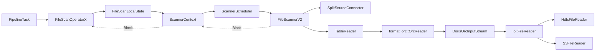
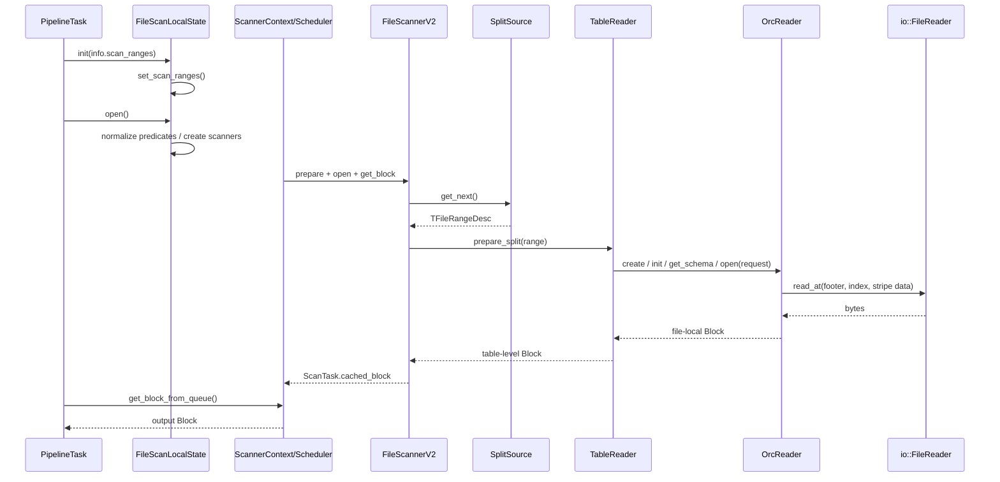

# Doris FileScan：从 Operator 到 Scanner、ORC Reader 与 IO

> 本文以 **FileScannerV2 读取外表 ORC 文件** 为主线，沿着一次真实查询解释
> `FileScanOperatorX -> Scanner -> TableReader -> OrcReader -> io::FileReader` 的职责和
> 调用关系。
>
> 想从 FE 怎样生成 File Split 开始看，可配合阅读同目录的
> [外部 ORC 扫描链路入门](file-scan-operator-scanner-orc-io-guide.md)。本文刻意把重点放在
> BE 执行链，尤其是容易混淆的 Operator、Scanner、ORC 与 IO 边界。

## 1. 先记住一条主线

以查询为例：

```sql
SELECT c1, c2
FROM hive_orc_tbl
WHERE dt = '2026-07-20' AND k > 100;
```

FE 已经把待读文件切成 `TFileRangeDesc` 后，BE 的主线是：

```text
PipelineTask
  -> FileScanOperatorX
  -> FileScanLocalState
  -> ScannerContext / ScannerScheduler
  -> FileScannerV2
  -> TableReader（Hive/Iceberg/Paimon 等表语义）
  -> format::orc::OrcReader（ORC 格式）
  -> DorisOrcInputStream
  -> io::FileReader（HDFS / S3 / 本地文件 / 文件缓存）
```

反方向的数据回流则是：

```text
io bytes
  -> ORC ColumnVectorBatch
  -> file-local Doris Block
  -> table-level Doris Block
  -> ScanTask.cached_block
  -> ScannerContext completed queue
  -> FileScanOperatorX::get_block_impl()
  -> PipelineTask / 下游 Operator
```



这不是一条同步函数栈：`PipelineTask` 和 `ScannerScheduler` 是两条调度线，中间由
`ScannerContext` 的 Block 队列连接。

## 2. 先分清六个对象

| 对象 | 生命周期 / 所属层 | 它负责什么 | 它不负责什么 |
| --- | --- | --- | --- |
| `FileScanOperatorX` | 一个计划中的 Operator 定义 | 描述符、Runtime Filter 描述、Limit、内存预算；向下游交付 Block | 不直接解码 ORC、不直接发 HDFS 请求 |
| `FileScanLocalState` | 每个 PipelineTask 一份 | SplitSource、scanner 数、ScannerContext、当前 Task 的谓词/Profile | 不直接解析 ORC 编码 |
| `ScannerContext` | 一个 LocalState 一份 | Scanner 并发、空闲 Block、完成队列、背压和依赖 | 不理解表 schema 或 ORC stripe |
| `FileScannerV2` | 多个，每个可连续处理多个 Split | 领取 Split、管理 TableReader 生命周期、接入 Scanner 公共过滤/LIMIT | 不直接做 ORC 字节解码 |
| `TableReader` | Scanner 内，一个格式/表语义入口 | 分区列、delete、schema mapping、将 table 条件局部化 | 不直接决定 HDFS/S3 的读取 API |
| `OrcReader` | 一个当前文件 Reader | ORC schema、投影、SARG、stripe/row group、解码 | 不认识 PipelineTask 或 SplitSource |
| `io::FileReader` | 一个物理文件 Reader | 按 `offset + length` 读取字节，可能带缓存 | 不认识 ORC、列、谓词 |

最容易混淆的两组名字是：

```text
format::FileReader  = 懂 ORC/Parquet 等文件格式，产出 file-local Block
io::FileReader      = 只懂随机读取字节，提供 read_at(offset, length)

PipelineTask         = 一条 Operator Pipeline 的调度实例
ScanTask             = 一个 Scanner 的一次扫描调度工作
```

## 3. 从计划到 LocalState：谁持有哪些状态

BE 解析 `FILE_SCAN_NODE` 时创建 `FileScanOperatorX`，见
[pipeline_fragment_context.cpp](../be/src/exec/pipeline/pipeline_fragment_context.cpp#L1551)。

随后每个 `PipelineTask::prepare()`：

1. 保存自己的 `scan_ranges`；
2. 为每个 Operator 创建该 Task 的 LocalState；
3. 将 `LocalStateInfo`（含 scan ranges、task index、profile）交给 LocalState。

对应实现见 [pipeline_task.cpp](../be/src/exec/pipeline/pipeline_task.cpp#L125)。

因此应这样理解：

```text
FileScanOperatorX
  = 共享的算子定义

FileScanLocalState
  = 某一个 PipelineTask 的执行现场
  = 这一份现场拥有 scanner / SplitSource / ScannerContext
```

通用 `ScanLocalState::init()` 会建立 `_scan_dependency`、Runtime Filter helper 与 profile，
并调用具体类的：

```cpp
set_scan_ranges(state, info.scan_ranges);
```

见 [scan_operator.cpp](../be/src/exec/operator/scan_operator.cpp#L173)。这正是 File Scan 将
FE 下发的任务描述变成“可被 scanner 领取的工作源”的入口。

## 4. `set_scan_ranges()`：不是给 scanner 固定分配文件

`FileScanLocalState::set_scan_ranges()` 在
[file_scan_operator.cpp](../be/src/exec/operator/file_scan_operator.cpp#L182)。它只做两件事：

```text
1. 选择共享的 SplitSourceConnector
2. 算当前 LocalState 要创建的 scanner 数 _max_scanners
```

它并不在这里创建 `FileScanner`，也不把某个 Split 永久绑定给某个 scanner。

### 4.1 先区分三个数量

```text
外层 TScanRangeParams 数
  != TFileRangeDesc（真实文件 Split）数
  != merge 后的 bucket 数
  != 最终创建的 scanner 数
```

`TFileRangeDesc` 才是“文件 path + start_offset + size”这一真实读取任务；它嵌在外层
`TScanRangeParams -> TFileScanRange.ranges` 中。

### 4.2 Local Split：任务已一次性下发到 BE

若不是“唯一一个 range 且包含 `split_source`”的 Batch 情况，代码创建：

```cpp
_split_source = std::make_shared<LocalSplitSourceConnector>(scan_ranges, _max_scanners);
_max_scanners = std::min(_max_scanners, _split_source->num_scan_ranges());
```

见 [file_scan_operator.cpp](../be/src/exec/operator/file_scan_operator.cpp#L214)。

`LocalSplitSourceConnector` 会通过 `_merge_ranges()` 合并**外层容器**，见
[split_source_connector.h](../be/src/exec/scan/split_source_connector.h#L54)。例如 FE 发来 10 个外层
range，当前最大 scanner 数为 3，合并后得到 3 个 bucket；此时 `num_scan_ranges()` 返回 3，
不是原始 10，也不是所有实际 `TFileRangeDesc` 的数量。

但领取任务时，`LocalSplitSourceConnector::get_next()` 在锁内逐个返回实际的
`TFileRangeDesc`，见 [split_source_connector.cpp](../be/src/exec/scan/split_source_connector.cpp#L27)。
因此：

```text
scanner 0 读完一个小 Split
  -> 与其他 scanner 竞争 get_next()
  -> 继续领取下一个真实 Split
```

这是一条共享队列，而不是“bucket 0 永远属于 scanner 0”。

### 4.3 Batch / Remote Split：BE 按批向 FE 拉任务

触发条件严格为：

```text
scan_ranges.size() == 1
且这个 range 含有 file_scan_range.split_source
```

这时创建 `RemoteSplitSourceConnector`，并将 `_batch_split_mode` 设为 true。BE 持有的是：

```text
split_source_id + 估算的 num_splits
```

而不是一开始就拥有所有真实 Split。远程 connector 的本地缓存耗尽后会调用 FE
`fetchSplitBatch()`，见 [split_source_connector.cpp](../be/src/exec/scan/split_source_connector.cpp#L44)。

Batch 模式下 `FileScanOperatorX::parallelism()` 返回 1，见
[file_scan_operator.h](../be/src/exec/operator/file_scan_operator.h#L110)。这里的 1 表示：

```text
每个 BE 只有一个 FileScan Operator / LocalState 实例
```

**不表示只创建一个 scanner。** 该 LocalState 内仍可创建多个 scanner，并发从远程
SplitSource 领取任务。

### 4.4 `_max_scanners` 怎么算

`set_scan_ranges()` 的上限同时受两类资源约束：

```text
min(
  远程 scanner 线程池容量 / operator parallelism,
  FileScanLocalState::max_scanners_concurrency()
)
```

见 [file_scan_operator.cpp](../be/src/exec/operator/file_scan_operator.cpp#L186)。普通 Local 模式还会
被合并后的 bucket 数再向下裁剪；Batch 模式不能可靠知道总 Split 数，故不做该裁剪。

## 5. `open()`：条件准备后才创建 scanner

`ScanLocalState::open()` 不是单纯的“打开文件”。它按顺序：

1. 获取已经到达的 Runtime Filter；
2. 计算稳定条件的 condition-cache digest；
3. 归一化 conjunct，生成可供 reader 利用的列谓词；
4. 若没有提前 EOS，调用 `_prepare_scanners()`；
5. 创建并初始化 `ScannerContext`。

见 [scan_operator.cpp](../be/src/exec/operator/scan_operator.cpp#L212)。

`_prepare_scanners()` 调用 FileScan 的 `_init_scanners()`，把 `ScannerSPtr` 包成
`ScannerDelegate`，再创建 `ScannerContext`，见
[scan_operator.cpp](../be/src/exec/operator/scan_operator.cpp#L1001)。

`FileScanLocalState::_init_scanners()` 循环 `_max_scanners` 次创建 `FileScanner` 或
`FileScannerV2`；它们都收到同一个 `_split_source`，见
[file_scan_operator.cpp](../be/src/exec/operator/file_scan_operator.cpp#L125)。

```text
一个 LocalState
  -> 一个共享 SplitSource
  -> N 个 FileScannerV2
  -> 一个 ScannerContext
```

## 6. ScannerContext：为什么 Operator 不直接调用 OrcReader

外部文件读取会等待对象存储、HDFS、文件缓存和解压。若 `PipelineTask` 直接同步读文件，
整条 Pipeline 会长期占用执行线程。

因此 Doris 用两段调度：

```text
Pipeline 调度器
  运行 PipelineTask，向 FileScanOperatorX 要 Block

ScannerScheduler
  在线程池中运行 Scanner，预先读出 Block
```

`ScannerScheduler::_scanner_scan()` 负责 scanner 的 `prepare()`、`open()`、读取 Block，以及
处理迟到 Runtime Filter，见 [scanner_scheduler.cpp](../be/src/exec/scan/scanner_scheduler.cpp#L180)。

读出的 Block 放入 `ScanTask::cached_block`，再由 `ScannerContext` 放进 `_completed_tasks`。
`ScannerContext::get_block_from_queue()` 将它 swap 给 Operator，见
[scanner_context.cpp](../be/src/exec/scan/scanner_context.cpp#L349)。

一个 `ScanTask` 不是“只读一批就销毁”：非 EOS task 在 Operator 消费完当前 cached Block 后会被
重新提交，形成“读一批 → 交一个 Block → 再调度”的生产/消费循环；只有 scanner EOS 后才真正
结束这一条 scanner 工作流。

因此 `ScanOperatorX::get_block_impl()` 的本质是：

```cpp
ctx->get_block_from_queue(state, block, eos, 0);
```

而不是：

```cpp
OrcReader::get_block(...);
```

对应实现见 [scan_operator.cpp](../be/src/exec/operator/scan_operator.cpp#L1318)。

## 7. `FileScannerV2`：一个 scanner 如何连续处理多个 Split

`FileScannerV2` 是“Split 生命周期管理者”，不是 ORC 解码器。

### 7.1 初始化与第一个 Split

构造时它保留共享 `_split_source`，并从 `QueryContext::file_scan_range_params_map` 取得
公共 `TFileScanRangeParams`；兼容路径才从 connector 获取，见
[file_scanner_v2.cpp](../be/src/exec/scan/file_scanner_v2.cpp#L291)。

打开时：

```text
_get_next_scan_range()
  -> SplitSourceConnector::get_next()
  -> 当前 TFileRangeDesc
  -> 选择 TableReader
  -> 初始化表达式和 TableReader
```

见 [file_scanner_v2.cpp](../be/src/exec/scan/file_scanner_v2.cpp#L336)。

这里有一个时序细节：`_open_impl()` 只领取首个 range、选择并初始化 `TableReader` 的公共
上下文；它**不会在这里完成当前 ORC Split 的物理 Reader 创建和全部读取**。真正的 per-Split
准备从第一次 `_get_block_impl()` 进入 `_prepare_next_split()` 开始，随后由
`TableReader::get_block()` 按需创建并打开当前文件 Reader。

### 7.2 准备一个 Split

`_prepare_next_split()`：

1. 领取下一个 `TFileRangeDesc`；
2. 从 `columns_from_path` 生成分区列值；
3. 调用 `TableReader::prepare_split()`；
4. 若分区条件已经能裁掉这个 Split，跳过并继续领取下一个；
5. 否则标记 `_has_prepared_split = true`。

见 [file_scanner_v2.cpp](../be/src/exec/scan/file_scanner_v2.cpp#L396)。

### 7.3 读取一个 Block

`_get_block_impl()` 调用：

```cpp
_table_reader->get_block(block, eof);
```

当前 Split 读完时，它将“当前 Split EOF”转换成“继续取下一个 Split”；只有 SplitSource 耗尽、
停止或取消时，整个 scanner 才 EOS。见
[file_scanner_v2.cpp](../be/src/exec/scan/file_scanner_v2.cpp#L358)。

随后 Scanner 基类负责公共行为：

```text
1. 调用 FileScannerV2::_get_block_impl() 获取源 Block
2. 执行残余 conjunct 的最终过滤
3. 更新所有 scanner 共享的 SQL LIMIT 额度
4. 处理 scanner 自己的 EOF / limit
```

实现见 [scanner.cpp](../be/src/exec/scan/scanner.cpp#L129)。这也是“部分谓词下推仍然正确”的
最后防线。

## 8. TableReader：表语义与 ORC 文件格式之间的桥

外表中的“表格式”和“文件格式”是两层：

```text
Hive / Iceberg / Paimon    = 表级语义
ORC / Parquet / CSV        = 一个物理文件的编码
```

所以 Iceberg ORC 的正常链路是：

```text
IcebergTableReader
  -> format::orc::OrcReader
```

而不是 Iceberg 绕过 ORC Reader。

`TableReader::prepare_split()` 先保存当前 range、生成 `io::FileDescription`、做分区过滤，
并处理当前 Split 的删除语义；若分区被裁掉，根本不需要创建主数据文件 reader。见
[table_reader.cpp](../be/src/format_v2/table_reader.cpp#L757)。

随后 TableReader 的职责包括：

```text
table/global 列空间
  -> 查询当前文件 schema
  -> TableColumnMapper 建 mapping
  -> 构造 FileScanRequest
  -> 将 projection / predicate 本地化为 file-local 列
  -> 调用 OrcReader::open(request)
```

这层存在的原因是：同一张 Hive/Iceberg/Paimon 表的不同文件可能出现列重排、缺失、
schema evolution、分区列或 delete 文件；`OrcReader` 不应该承担这些表级规则。

一个容易忽略的惰性时序是：`FileScannerV2::_open_impl()` 创建的是可跨 Split 复用的
`TableReader` 和公共上下文；直到第一次 `TableReader::get_block()`，才会按当前 Split 创建
具体 `OrcReader`、读取文件 schema、建立 `TableColumnMapper` 并打开文件级 reader。于是只要
`prepare_split()` 的分区裁剪成功，主 ORC 文件 reader 根本不会创建。

## 9. OrcReader：ORC 的 schema、stripe、过滤和解码

### 9.1 `init()`：先建立字节读取通道，再让 ORC 库识别文件

`OrcReader::init()` 先调用 `format::FileReader::init()`，建立底层 `io::FileReader`；然后将其
包成 `DorisOrcInputStream`，交给 ORC C++ 库的 `::orc::createReader()`。见
[orc_reader.cpp](../be/src/format_v2/orc/orc_reader.cpp#L858)。

此阶段 ORC 库会读取识别文件所需的元数据；之后 TableReader 才能取得当前文件 schema，建立
table 列到 file-local 列的 mapping。

### 9.2 `open(request)`：决定读哪些列、哪些 stripe

`OrcReader::open()` 主要完成：

```text
FileScanRequest
  -> predicate columns + non-predicate columns
  -> ORC projection
  -> SARG / 本地过滤条件
  -> Split byte range
  -> stripe statistics pruning
  -> ORC RowReader
```

见 [orc_reader.cpp](../be/src/format_v2/orc/orc_reader.cpp#L1162)。

这里要特别区分：

| 名词 | 所属层 | 用途 |
| --- | --- | --- |
| Doris Split | 调度层 | 决定这一 scanner 负责哪段文件工作 |
| ORC Stripe | ORC 文件格式 | 独立的编码/统计单元，Reader 按它创建读取范围 |
| HDFS Block | 存储系统 | 数据块与副本管理单元 |
| Doris `Block` | 执行引擎 | 一批内存列数据 |

它们的边界不必对齐。Split 主要帮助 ORC Reader 划分 stripe 归属；ORC 仍可能需要读取
全文件 footer、stripe footer 和索引等元数据。

### 9.3 `get_block()`：ORC C++ 批读取后解码

`OrcReader::get_block()` 循环调用 ORC RowReader 的 `next()`，必要时切换到下一个选中 stripe，
再把 ORC 的 `ColumnVectorBatch` 解码成 Doris 列。见
[orc_reader.cpp](../be/src/format_v2/orc/orc_reader.cpp#L1822)。

如果开启 lazy materialization，Reader 会先处理过滤列，确定保留行后再读取非过滤列；它是
ORC/Reader 层的读取优化，不改变 Scanner 层最终过滤的语义。

更精确地说：`init()` 主要完成文件 metadata/footer 与 root schema 的识别；`open()` 配置
projection、SARG、Split 约束和 RowReader；真实 stripe footer、row index 和数据 stream 的读取
主要随着 `get_block()` 中的 `row_reader->next()` 发生。

## 10. 条件、Runtime Filter 与 Condition Cache 分别在哪一层

同一个 `WHERE` 条件可能在多层发挥作用：

```text
分区列条件
  -> TableReader::prepare_split() 直接跳过整个 Split

稳定的文件列条件
  -> OrcReader 的 SARG / stripe statistics / row-level 过滤

FileScan 部分下推条件
  -> reader 可提前少读，但原始 conjunct 保留

Scanner 基类
  -> _filter_output_block() 做最终正确性过滤

迟到 Runtime Filter
  -> ScannerScheduler 调度时尝试追加；不能假定在开始读时已全部到达
```

按“跳过的粒度”分类会更清楚：

| 优化 | 跳过什么 | 发生层 |
| --- | --- | --- |
| partition prune | 整个 Split，连具体 FileReader 都不建 | `TableReader::prepare_split()` |
| stripe prune | 被统计信息/SARG 排除的 ORC stripe | `OrcReader::open()` |
| row-group prune | stripe 内的 row group | ORC index + SARG / RowReader |
| row filter | 已读出的候选行 | file-local reader 与 `Scanner::_filter_output_block()` |

SARG 只是前面几层的过滤优化，不是最终正确性保证。`TableColumnMapper` 只能将可安全本地化的
条件写入 `FileScanRequest`；不能转成 SARG 或只能部分下推的表达式仍然保留，最终由 Scanner
对 table-level Block 执行原始 conjunct。

Condition Cache 也不要和数据页缓存混淆。它缓存的不是 Block 或文件字节，而是：

```text
同一未变文件 + 同一稳定条件
  -> 每 2048 行一个 bit
  -> false 表示该 granule 没有任何存活行，可整块跳过
  -> true 仅表示可能有存活行，仍需精确过滤
```

`ConditionCacheContext::GRANULE_SIZE` 为 2048，定义见
[condition_cache.h](../be/src/storage/segment/condition_cache.h#L44)。

`ScanLocalState::open()` 先把 query option seed 与 conjunct digest 混合得到
`_condition_cache_digest`；有 TopN runtime filter 时直接置 0，见
[scan_operator.cpp](../be/src/exec/operator/scan_operator.cpp#L240)。

`digest == 0` 一定禁用；非 0 只是必要条件。存在 delete 文件、COUNT 聚合下推、没有 reader
可执行的行级条件或 Runtime Filter 时，V2 `TableReader` 仍会拒绝使用缓存，避免把动态/不完整
结果写成可跨查询复用的缓存。见
[table_reader.cpp](../be/src/format_v2/table_reader.cpp#L546)。

缓存 miss 时，Reader 只在完整读到 EOF 后才写入位图；LIMIT 或取消导致的半截读取不会写入，
避免将“未读区域的默认 false”错误当作“无匹配”。见
[table_reader.cpp](../be/src/format_v2/table_reader.cpp#L618)。

## 11. 从 `DorisOrcInputStream` 到 HDFS/S3 的真实 IO

### 11.1 适配器只做一件事：把 ORC 的字节请求转成 Doris `read_at`

ORC C++ 库不知道 Doris 的文件系统抽象；它通过 `DorisOrcInputStream` 请求某段字节。
适配器最终调用底层：

```text
io::FileReader::read_at(offset, length)
```

所以底层 IO 不会再按 Doris Split 二次裁剪请求；它只执行 ORC Reader 发出的具体 offset/length
读取。

### 11.2 `format::FileReader::init()` 创建物理 Reader

`format::FileReader::init()` 经 `io::DelegateReader::create_file_reader()` 创建物理 reader，
并在有统计对象时包 `TracingFileReader`。见
[file_reader.cpp](../be/src/format_v2/file_reader.cpp#L69)。

常见对象链：

```text
DorisOrcInputStream
  -> TracingFileReader
  -> CachedRemoteFileReader（若文件缓存启用）
  -> HdfsFileReader / S3FileReader
```

`FileFactory` 根据 `TFileType` 选择实际实现：`FILE_HDFS` 创建 `HdfsFileReader`，`FILE_S3`
创建 `S3FileReader`，见 [file_factory.cpp](../be/src/io/file_factory.cpp#L213)。

### 11.3 跨 HDFS Block 由谁处理

若 ORC 请求：

```text
read_at(offset = 120 MB, length = 20 MB)
```

而 HDFS Block 边界为 128 MB，这个请求会跨 Block。Doris 不需要在 OrcReader 里手写
“跨 HDFS Block”分支：`HdfsFileReader` 把 offset/length 请求交给 HDFS 客户端，客户端根据
Block 元数据和副本选择 DataNode 并完成跨块读取。

因此：

```text
FE 尽量按 HDFS Block 切 Split = 性能/本地性优化
跨 HDFS Block 仍可正确读取   = HDFS 客户端的职责
```

同理，`hosts` 是 FE 为 BE 选择位置时的 locality hint，不是 ORC Reader 必须连接的
DataNode 地址。

## 12. 并发与 LIMIT：再区分三件事

| 名称 | 它控制什么 | FileScan 当前含义 |
| --- | --- | --- |
| `parallelism()` | Operator / LocalState 实例数 | Batch Split 返回 1，但内部仍可多 scanner |
| `_max_scanners` | 一个 LocalState 创建多少 scanner | 由线程池、session 上限、SplitSource 状态决定 |
| `_shared_scan_limit` | 多个 scanner 共享的 SQL LIMIT 剩余额度 | 某个 scanner 产出行后递减，其他 scanner 可尽早停止 |

还有一个名字很像、但主要属于 Olap key-TopN 的字段：

```cpp
int64_t _limit_per_scanner = -1;
```

它当前由 `OlapScanOperatorX` 在匹配 key sort 的 TopN 场景设置，并由 `OlapScanner` 用于
`read_orderby_key_limit`；不是 FileScannerV2 的常规文件扫描 LIMIT。参见
[olap_scan_operator.cpp](../be/src/exec/operator/olap_scan_operator.cpp#L1271) 与
[olap_scanner.cpp](../be/src/exec/scan/olap_scanner.cpp#L588)。

## 13. 一次 Split 的紧凑时序



## 14. 调试与阅读顺序

### 推荐源码阅读顺序

```text
1. be/src/exec/operator/file_scan_operator.{h,cpp}
2. be/src/exec/operator/scan_operator.{h,cpp}
3. be/src/exec/scan/split_source_connector.{h,cpp}
4. be/src/exec/scan/scanner_context.cpp + scanner_scheduler.cpp
5. be/src/exec/scan/file_scanner_v2.cpp + scanner.cpp
6. be/src/format_v2/table_reader.{h,cpp}
7. be/src/format_v2/column_mapper.{h,cpp}
8. be/src/format_v2/orc/orc_reader.{h,cpp}
9. be/src/format_v2/file_reader.cpp
10. be/src/io/file_factory.cpp + be/src/io/fs/{hdfs,s3}_file_reader.cpp
```

### 有用的断点

```text
FileScanLocalState::set_scan_ranges
FileScanLocalState::_init_scanners
ScanLocalState::open
ScannerScheduler::_scanner_scan
FileScannerV2::_get_next_scan_range
FileScannerV2::_prepare_next_split
TableReader::prepare_split
format::orc::OrcReader::init
format::orc::OrcReader::open
format::orc::OrcReader::get_block
DorisOrcInputStream::read
HdfsFileReader::read_at_impl / S3FileReader::read_at_impl
ScannerContext::get_block_from_queue
```

### Profile 排障顺序

若 FileScan 慢，先判断时间在哪一层：

```text
GetSplitTime                 -> 等 FE 远程 Split
Scanner worker wait           -> 等 Scanner 线程池
FileReadCalls/Bytes/Time      -> 物理读或文件缓存
OrcReader profile             -> footer、SARG、stripe、解码
Scanner filter time           -> 残余表达式过滤
ScannerContext queue          -> 背压或下游消费慢
```

## 15. V1 路径提示

本文主讲 V2：

```text
FileScannerV2 -> TableReader -> format::orc::OrcReader
```

若 Profile 中 `UseScannerV2` 为 false，则仍保留相同的 Operator、SplitSource、ScannerContext
大骨架，但 Scanner 以下会进入旧的 `FileScanner -> GenericReader / vorc_reader` 路径。调试前先
确认 V1/V2，否则容易把两套 reader 生命周期混在一起。

## 16. 最终心智模型

```text
调度层：PipelineTask + FileScanOperatorX + ScannerContext
  决定谁运行、Block 如何在异步边界交接

任务层：SplitSource + FileScannerV2
  决定读哪个 Split、何时换下一个 Split

语义/格式层：TableReader + TableColumnMapper + OrcReader
  决定表列如何映射到文件列、哪些 stripe/行需要读取、如何解码

IO 层：DorisOrcInputStream + io::FileReader
  决定怎样将 offset/length 请求落到 HDFS、S3、缓存或本地文件
```

遇到问题时，先判断它跨越的边界：

```text
Split 丢失/不均衡       -> SplitSource / scanner 并发
Operator 等不到 Block   -> ScannerContext / Dependency
分区、delete、schema    -> TableReader / ColumnMapper
stripe、SARG、解码       -> OrcReader
远程读、缓存、短读      -> io::FileReader / HDFS / S3
```
