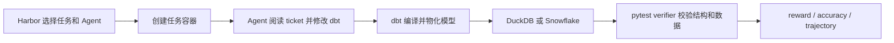
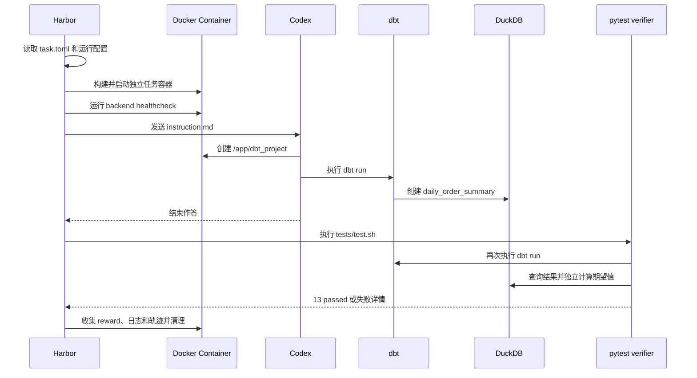
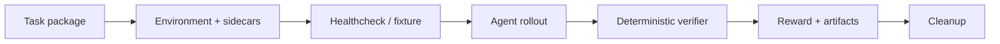

# data-eng-bench、dbt-doris Demo 与 Doris 后端可行性调研

> 调研日期：2026-08-12；实施验证更新：2026-08-14、2026-08-17
>
> data-eng-bench 基线：`master@53353547b9869d35d61b40fd6ee9397a7ac8ca80`
>
> 结论口径：仓库明示事实、静态扫描结果和本文推断分别标注，避免把研发状态写成已发布能力。

## 1. 执行摘要

结论可以压缩成六点：

1. [Snowflake-Labs/data-eng-bench](https://github.com/Snowflake-Labs/data-eng-bench/tree/53353547b9869d35d61b40fd6ee9397a7ac8ca80)
   是一个评测 **Coding Agent 能否正确完成 dbt 数据工程任务** 的 benchmark。
   它不是 DuckDB、Snowflake 或 Doris 的查询性能 benchmark，也不是 dbt adapter
   的官方一致性测试套件。
2. dbt 是被 Agent 修改和执行的工程层；DuckDB 是默认、无需账号、可在容器内密闭
   复现的执行后端；Snowflake 是同一批任务的云后端，用来暴露 SQL 方言、Warehouse、
   Role 和平台惯用法等特定差异。
3. Doris 可以成为第三个执行后端，但正确表述应是 **Doris backend compatibility /
   agent portability evaluation**。不能只替换连接串，也不能据此宣称 Doris 比
   DuckDB 或 Snowflake 更快。
4. Fork 中已经新增一个带 Doris sidecar、fixture、dbt model/test 和确定性 verifier 的 Harbor
   tracer task，两条执行路径均为 `reward=1`。它可以作为发布 Demo 的实现依据，但仍需决定
   最终放在 adapter 仓库、Doris 文档还是独立 examples 仓库。
5. fast-30 的 30 个参考解法均已在 Doris 完成；原 DuckDB oracle 为 862/869，补齐 FIFO
   后端语义后的 Doris oracle 为 869/869。它证明的是 golden-solution 兼容性，不是 Agent 分数。
6. 当前 dbt-doris 的“已完善能力”分为上游已合入、本地已提交但未上游、工作区未提交
   三层。Demo 和对外文档必须固定 adapter commit、dbt Core 与 Doris 版本，不能把
   三层能力合并宣传。

建议决策如下：

| 事项 | 建议 | 原因 |
| --- | --- | --- |
| 正式发布 dbt-doris 五分钟 Demo | **基于已通过 tracer 收口** | 核心链路已有可执行证据，仍需确定产品入口和 CI |
| 将一个 data-eng-bench 任务跑在 Doris | **已完成** | Harbor sidecar tracer 两条路径均为 `reward=1` |
| fast-30 参考解法兼容性实验 | **已完成** | 30/30 graph、869/869 Doris oracle；下一步是正式 task variant 与 Agent trial |
| 直接移植全部 103 个任务 | **条件式推进** | 当前有版本、双工程、数据装载、隔离、方言和 verifier 六类系统性成本 |
| 直接把 Doris 结果提交现有官方榜单 | **暂不做** | 榜单无 backend 维度且 task digest 会变化 |
| 用本仓库比较 Doris 与 DuckDB 查询性能 | **不做** | harness 的测量对象和变量控制都不支持数据库性能结论 |

## 2. 范围、方法与证据等级

本文回答五个问题：

- `data-eng-bench` 是做什么的，dbt 和 DuckDB 分别扮演什么角色？
- dbt-doris 当前究竟具备哪些已发布、已提交和实验能力？
- 缺少的 dbt-doris Demo 应该长什么样？
- DuckDB 版本的任务能否在 Doris 上运行，改造量和研究价值是什么？
- Snowflake、dbt Labs、DuckDB、Doris 和 Harbor 是否发布了相关资料？

本文采用三类证据：

- **仓库明示**：README、代码、配置、提交、CITATION、NOTICE 和官方文档直接陈述的事实。
- **静态扫描**：在固定 commit 上用文件枚举和文本搜索得到的数字；这些不是项目官方指标。
- **本文推断**：基于上述证据给出的架构、实验设计和路线建议，均明确使用“建议”“预计”或“不能直接”等表述。

GitHub 星标、Issue、网页内容和默认分支都会变化，因此本调研将 `data-eng-bench` 固定在提交
[`53353547`](https://github.com/Snowflake-Labs/data-eng-bench/tree/53353547b9869d35d61b40fd6ee9397a7ac8ca80)。

## 3. data-eng-bench 到底是什么

### 3.1 定位

仓库 [README](https://github.com/Snowflake-Labs/data-eng-bench/blob/53353547b9869d35d61b40fd6ee9397a7ac8ca80/README.md)
将它定义为大型、现实零售数仓上的 dbt 数据工程 Coding Agent 评测。每个任务给 Agent
一个 ticket 风格的需求和容器化 dbt 项目；Agent 修改或创建模型并运行 dbt，随后由运行时
隔离的 pytest verifier 检查物化结果。公开仓库允许维护者审阅 verifier 和 solution；
正式实验应把“不让 Agent 访问 verifier、solution 或网络上的参考解法”作为完整性约束。

执行链可以概括为：



因此它测量的是如下复合能力：

- Agent 能否理解数据工程 ticket；
- 能否在大型 dbt 项目中找到正确的模型、source、ref 和宏；
- 能否写出目标后端可执行且业务语义正确的 SQL；
- 能否正确配置 materialization、test、snapshot 或 incremental；
- 能否通过结构、行级结果、公式和幂等性验证。

### 3.2 任务规模与类别

README 明示共有 103 个任务：

| 类别 | 数量 | 典型工作 |
| --- | ---: | --- |
| Analytics | 65 | 留存、RFM、CLTV、欺诈、归因、商品关联、ROI 等分析 Mart |
| Development / bug fixes | 16 | 修复 SQL、NULL、除零、逻辑或不完整模型 |
| Dimensional modeling / snapshots | 9 | 事实表、维表和 SCD 历史 |
| Data engineering | 13 | Incremental、多数据库和工程型转换 |

难度分布为 3 easy、47 medium、45 hard、8 very hard。上述分类是 README 的汇总口径；
各 `task.toml` 的原始 category vocabulary 更细，不应混为同一个统计口径。

[`dataset.toml`](https://github.com/Snowflake-Labs/data-eng-bench/blob/53353547b9869d35d61b40fd6ee9397a7ac8ca80/dataset.toml)
用 SHA-256 固定每个任务。每个任务都包含 instruction、solution、Docker 环境和 pytest
verifier；一个最小实例可见
[`dbt-fix-division-by-zero`](https://github.com/Snowflake-Labs/data-eng-bench/tree/53353547b9869d35d61b40fd6ee9397a7ac8ca80/tasks/dbt-fix-division-by-zero)。

### 3.3 dbt、DuckDB 和 Snowflake 的角色

| 组件 | 角色 | 不应被误解为 |
| --- | --- | --- |
| dbt | Agent 的工作对象、依赖图、SQL/Jinja 编译和物化执行层 | 只是在任务里偶然出现的工具 |
| DuckDB | 默认、零账号、数据库文件随镜像分发的 hermetic 后端 | 被测数据库性能的基准冠军 |
| Snowflake | 同 103 题的云后端，额外引入方言、Role、Warehouse 和平台惯用法 | 只用于装载 DuckDB 文件 |
| Harbor | 任务打包、容器、Agent 执行、重复试验和结果发布框架 | dbt adapter 测试框架 |

仓库明确说同时运行 DuckDB 与 Snowflake，可以帮助定位“通用建模错误”和“Snowflake
特定错误”。这是一种后端可移植性对照，不是标准数据库性能实验。

### 3.4 工程和数据规模

基础镜像固定了 `dbt-duckdb==1.10.0`、`dbt-snowflake==1.10.3`、
`dbt-core>=1.8,<1.11`、`duckdb==1.2.2`，见
[`base-image/Dockerfile`](https://github.com/Snowflake-Labs/data-eng-bench/blob/53353547b9869d35d61b40fd6ee9397a7ac8ca80/base-image/Dockerfile)。
两套项目均固定 `dbt_utils==1.3.3`。

在固定 commit 上的静态扫描结果为：

- DuckDB `models/` 下有 2,356 个 SQL 和 31 个 YAML，共 2,387 个文件；
- Snowflake `models/` 下有 2,355 个 SQL 和 31 个 YAML，共 2,386 个文件；
- DuckDB 工程中至少 185 个文件直接出现 `dbt_utils.` 调用；
- 两套项目相同相对路径的文件中，只有 238 个字节完全一致，2,183 个不同。

最后一项说明现状不是“一套跨库 SQL 加两个 profile”，而是已经形成实质性的后端双副本。
新增 Doris 若继续复制第三套工程，长期维护成本会显著增加。

合成零售数据库 `retail.duckdb` 由 Git LFS 管理，精确对象大小为 488,910,848 字节；
数据域覆盖订单、客户、商品、库存、SAP、SFDC、GA、POS、WMS、支付、财务和 HR 等。
[`NOTICE`](https://github.com/Snowflake-Labs/data-eng-bench/blob/53353547b9869d35d61b40fd6ee9397a7ac8ca80/NOTICE)
说明任务、模型和 retail 数据为 Snowflake 原创的合成内容，不含真实客户数据或第三方专有数据。

基础镜像构建时会先修正一处源数据问题，再执行 `dbt deps` 和完整 `dbt run`，预物化公共
staging/intermediate 层。Snowflake 版本使用
[`migrate_duckdb.py`](https://github.com/Snowflake-Labs/data-eng-bench/blob/53353547b9869d35d61b40fd6ee9397a7ac8ca80/base-image/migrate_duckdb.py)
枚举 DuckDB schema/table、映射类型并上传；每个 trial 再创建独立数据库 clone。

### 3.5 Verifier 与排行榜实际测什么

固定 commit 的静态扫描显示：

- 103/103 个 verifier 都直接连接并分支处理 DuckDB 与 Snowflake；
- 86/103 查询 `information_schema`；
- 10 个使用 DuckDB `pragma_table_info`；
- 按读取模型源码等模式扫描，约 17 个还会静态检查模型 SQL；
- 上游 [PR #2](https://github.com/Snowflake-Labs/data-eng-bench/pull/2) 描述 verifier
  中存在 436 个 `DB_TYPE` 分支。

PR #2 还删除了 97/103 个任务中“同时兼容 DuckDB 与 Snowflake”的提示，因为一次 trial
实际上只为当前 `DB_TYPE` 评分。PR 作者同时提示，Prompt 变化会让新旧成绩不再严格可比。
这说明后端是 benchmark variant 的组成部分，而不是 Agent 在一次任务中必须顺手兼容的额外目标；
Doris 也应该作为显式、版本化的第三 variant 引入。

任务解法和相关文件的辅助静态扫描还发现：56 题使用 `target.type` Jinja 分支，78 题涉及
日期时间方言，32 题涉及 percentile/median，10 题使用 `adapter.get_relation`，另有少量
ARRAY/JSON/VARIANT、`QUALIFY`、Incremental 和 Snapshot 任务。这些数字不是官方兼容性
声明，但足以说明新增后端不是更改一个 profile。

排行榜主指标是成功 trial 占全部 trial 的比例，同时展示标准误、pass@2、pass@3、Token、
成本和平均时长等信息，见
[`leaderboard.yaml`](https://github.com/Snowflake-Labs/data-eng-bench/blob/53353547b9869d35d61b40fd6ee9397a7ac8ca80/leaderboard/leaderboard.yaml)。
这些是 Agent 完成任务的指标，不能直接解释为数据库吞吐、延迟或性价比。

README 还特别标注 `dbt-fix-timezone-sales` 的 DuckDB verifier 可能受顺序影响，其单项结果
只能作为参考。这也是解读通过率时需要保留任务级已知限制的例子。

## 4. 完整示例：一项 dbt 任务如何被 Harness 执行

本节使用 easy 任务
[`dbt-daily-order-summary`](https://github.com/Snowflake-Labs/data-eng-bench/tree/53353547b9869d35d61b40fd6ee9397a7ac8ca80/tasks/dbt-daily-order-summary)
展示一次完整评测。它要求 Agent 从零创建 dbt 项目，从 `ORDERS.ORDERS` 生成每日订单汇总表。

### 4.1 这个例子中各组件分别负责什么

| 组件 | 在本题中的职责 |
| --- | --- |
| Harbor | 读取任务、创建 trial、启动 Agent、调用 verifier、记录结果并清理 |
| `task.toml` | 定义题目元数据、CPU/内存、Agent 和 verifier 超时、健康检查 |
| Docker | 提供独立文件系统、依赖、dbt 工程工作区和数据库环境 |
| Codex 等 Agent | 阅读 ticket，在 `/app/dbt_project` 创建并调试 dbt 项目 |
| dbt | 解析 Project、编译 Jinja/SQL，并把模型物化为数据库表 |
| DuckDB/Snowflake | 执行 SQL 并保存本次作答生成的 Relation |
| pytest verifier | 独立计算期望结果，检查结构、数据、业务逻辑和幂等性 |
| `reward.txt` | 保存本次 trial 的二元结果：全部通过为 1，否则为 0 |

这里的 **Harness 是 Harbor 加上该任务的容器、健康检查、测试入口和生命周期约定**；
pytest 只负责判分，dbt 只负责转换，DuckDB 只负责执行 SQL。

### 4.2 完整时序



DuckDB 流程可以使用类似命令启动：

```bash
harbor run \
  --path tasks \
  --task-name dbt-daily-order-summary \
  --agent codex \
  --model openai/gpt-5.6 \
  --env DB_TYPE=duckdb
```

正式批量运行通常使用仓库中的 Harbor config，以统一 Agent、模型、attempt 数、并发和资源。
例如
[`data-eng-bench-duckdb.codex.yaml`](https://github.com/Snowflake-Labs/data-eng-bench/blob/53353547b9869d35d61b40fd6ee9397a7ac8ca80/configs/data-eng-bench-duckdb.codex.yaml)
固定了 DuckDB、Codex、模型配置、三次 attempt 和四个并发 trial。

### 4.3 第一步：Harbor 读取题目和资源约束

该任务的
[`task.toml`](https://github.com/Snowflake-Labs/data-eng-bench/blob/53353547b9869d35d61b40fd6ee9397a7ac8ca80/tasks/dbt-daily-order-summary/task.toml)
声明：

- 难度为 `easy`，类别为 `analytics`；
- Agent 超时 4,000 秒，verifier 超时 3,000 秒；
- trial 可使用 2 个 CPU、8,000 MB 内存和 10,240 MB 存储；
- 容器启动后执行 `python3 /snowflake_clone.py` 作为 backend healthcheck。

最后一个命令在 DuckDB 模式下是快速 no-op；在 Snowflake 模式下会建立本 trial 使用的
独立数据库 clone。也就是说，题目文件只描述“需要什么环境”，实际调度、超时和失败处理由
Harbor 完成。

### 4.4 第二步：构建独立容器并准备数据库

该题的
[`environment/Dockerfile`](https://github.com/Snowflake-Labs/data-eng-bench/blob/53353547b9869d35d61b40fd6ee9397a7ac8ca80/tasks/dbt-daily-order-summary/environment/Dockerfile)
只继承公共基础镜像：

```dockerfile
FROM ghcr.io/snowflake-labs/data-eng-bench-base:1.0.0
```

公共镜像已经包含 dbt、两个 adapter、pytest、参考 dbt 工程和
`/app/database/retail.duckdb`。该任务不预置待修改模型，因为 Agent 必须从零创建 Project。

[`docker-compose.yaml`](https://github.com/Snowflake-Labs/data-eng-bench/blob/53353547b9869d35d61b40fd6ee9397a7ac8ca80/tasks/dbt-daily-order-summary/environment/docker-compose.yaml)
把 `DB_TYPE`、DuckDB 路径或 Snowflake 凭据传入容器，并让容器保持运行。每个 trial 使用
独立容器和写层，因此 Agent 的文件及 DuckDB 写入不会直接污染另一个 trial。

### 4.5 第三步：Agent 收到 ticket 并创建 dbt 项目

[`instruction.md`](https://github.com/Snowflake-Labs/data-eng-bench/blob/53353547b9869d35d61b40fd6ee9397a7ac8ca80/tasks/dbt-daily-order-summary/instruction.md)
要求 Agent：

1. 先读取实时 `DB_TYPE`，不能根据题目文字猜后端；
2. 不修改两个参考 Project，而是在 `/app/dbt_project` 从零创建一个独立 Project；
3. 从 `ORDERS.ORDERS` 读取订单；
4. 排除 `CANCELLED`、`RETURNED`、`FAILED`；
5. 按 `ORDERED_AT` 的日期统计订单数和两位小数收入；
6. 在 `daily_analytics` 中物化 Table `daily_order_summary`。

一个合理的 Agent 产物大致是：

```text
/app/dbt_project/
├── dbt_project.yml
├── profiles.yml
└── models/
    ├── staging/
    │   └── sources.yml
    └── marts/
        └── daily_order_summary.sql
```

DuckDB profile 的核心配置类似：

```yaml
dbt_project:
  target: dev
  outputs:
    dev:
      type: duckdb
      path: /app/database/retail.duckdb
      schema: daily_analytics
```

按题目要求，Agent 还需要让 dbt 从该目录读取 profile，例如：

```bash
export DBT_PROFILES_DIR=/app/dbt_project
```

模型的核心业务 SQL 类似：

```sql
with valid_orders as (
    select
        cast(ordered_at as date) as order_date,
        grand_total
    from {{ source('orders', 'orders') }}
    where status not in ('CANCELLED', 'RETURNED', 'FAILED')
)

select
    order_date,
    count(*) as order_count,
    round(sum(grand_total), 2) as total_revenue
from valid_orders
group by order_date
order by order_date
```

Agent 可以反复执行 `dbt debug`、`dbt compile`、`dbt run` 和 SQL 查询来调试。最终必须让：

```text
daily_analytics.daily_order_summary
```

真实存在于当前后端。仓库中的
[`solution/solve.sh`](https://github.com/Snowflake-Labs/data-eng-bench/blob/53353547b9869d35d61b40fd6ee9397a7ac8ca80/tasks/dbt-daily-order-summary/solution/solve.sh)
是维护者验证任务可解的 golden solution，不是正常评测时替 Agent 作答的脚本。

### 4.6 第四步：Harbor 调用 verifier，而不是相信 Agent 的自述

Agent 结束后，Harbor 执行任务的
[`tests/test.sh`](https://github.com/Snowflake-Labs/data-eng-bench/blob/53353547b9869d35d61b40fd6ee9397a7ac8ca80/tasks/dbt-daily-order-summary/tests/test.sh)：

```bash
pytest /tests/test_outputs.py -v
```

[`test_outputs.py`](https://github.com/Snowflake-Labs/data-eng-bench/blob/53353547b9869d35d61b40fd6ee9397a7ac8ca80/tasks/dbt-daily-order-summary/tests/test_outputs.py)
首先在 Agent 留下的 Project 中再次执行 `dbt run`。因此 verifier 检查的是最终工作区能否从头
构建，而不是 Agent 是否输出了“已经完成”。随后运行 13 个测试：

| 测试组 | 数量 | 验证内容 |
| --- | ---: | --- |
| Structure | 4 | 表和三列存在、有数据、没有 NULL |
| Data quality | 5 | 日期唯一、订单数为正、收入非负、两位小数、日期顺序稳定 |
| Correctness | 3 | 状态过滤生效，订单总数和收入与 Source 独立计算一致 |
| Idempotency | 1 | 再运行一次 `dbt run` 后逐行结果不变 |

Correctness 测试不会使用 Agent 自己计算的中间结果，而是直接从 Source 重新计算 oracle：

```sql
select
    count(*) as total_orders,
    round(sum(grand_total), 2) as total_revenue
from orders.orders
where status not in ('CANCELLED', 'RETURNED', 'FAILED')
```

这能识别“表建出来了，但忘记过滤状态”或“收入公式写错”等业务错误。

### 4.7 第五步：生成 Reward、保存轨迹并清理

`test.sh` 只有在 pytest 退出码为 0、通过数大于 0、且没有 skipped/failed 时才写：

```bash
echo 1 > /logs/verifier/reward.txt
```

任一测试失败或跳过都会写 `0` 并让 verifier 失败。Harbor 再汇总本次 trial 的 reward、
Agent 轨迹、Token、耗时和日志，最后删除任务容器；Snowflake variant 还会删除数据库 clone。

所以这里的判定不是“SQL 能执行就算成功”，而是：

```text
Project 可重建
AND Relation 结构正确
AND 业务结果正确
AND 重跑结果稳定
```

### 4.8 同一流程换成 Doris 时，哪里需要变化

Harbor、ticket、Agent 作答和 reward 机制原则上都可以保留，但 backend 集成层必须扩展：

| 原流程节点 | DuckDB 当前实现 | Doris variant 所需实现 |
| --- | --- | --- |
| 基础镜像 | 安装 `dbt-duckdb`，内置数据库文件 | 安装版本匹配的 `dbt-doris` 和 Doris 客户端 |
| Backend | 容器内打开 `retail.duckdb` | 连接独立的 Doris 测试集群 |
| 数据准备 | 镜像内已有 `ORDERS.ORDERS` | 为 tracer task 导入 `ORDERS.ORDERS` 依赖闭包 |
| Healthcheck | DuckDB no-op | 等待 FE/BE，并执行真实查询和 trial namespace 初始化 |
| Profile | DuckDB 类型和路径 | Doris 类型、地址、凭据和 database/schema |
| Table | 普通 dbt Table | 配置 Doris key、distribution、bucket 和单副本属性 |
| Verifier | DuckDB Python connection | MySQL Connector、Doris metadata 和值类型归一化 |
| 隔离/清理 | 独立容器写层 | trial 专用 database/用户，结束后按 trial ID 删除 |

对于这道 tracer task，第一版不需要迁移完整 489 MB 数据库，只需迁移
`ORDERS.ORDERS` 及 verifier 的必要闭包。接着：

1. 先运行 Doris golden solution，确保 13/13 测试稳定通过；
2. 再让 Codex 在相同 Doris variant 中作答；
3. 把失败归类为 Agent、SQL 方言、dbt-doris、Doris engine 或 Harness；
4. 若要与 DuckDB/Snowflake 比较，应在同一个三后端 revision 上重跑，不使用旧榜单成绩。

这个例子也说明新增 Doris 的核心不是另写一套 Harbor，而是让现有 Harness 能够可靠地准备、
隔离、验证和清理 Doris backend。

## 5. 他们发布了哪些相关资料

### 5.1 data-eng-bench 自身的一手资料

截至调研日，能够确认的一手资料主要是：

- [README](https://github.com/Snowflake-Labs/data-eng-bench/blob/53353547b9869d35d61b40fd6ee9397a7ac8ca80/README.md)：定位、运行方法、后端差异和完整任务概览；
- [Harbor 数据集页面](https://hub.harborframework.com/datasets/snowflake-labs/data-eng-bench/latest)：公开数据集版本；
- [PUBLISHING.md](https://github.com/Snowflake-Labs/data-eng-bench/blob/53353547b9869d35d61b40fd6ee9397a7ac8ca80/PUBLISHING.md)：维护者发布手册；
- [Leaderboard 提交说明](https://github.com/Snowflake-Labs/data-eng-bench/blob/53353547b9869d35d61b40fd6ee9397a7ac8ca80/leaderboard/SUBMIT.md)：
  canonical digest、至少三次 trial 和轨迹审查要求；
- [CITATION.cff](https://github.com/Snowflake-Labs/data-eng-bench/blob/53353547b9869d35d61b40fd6ee9397a7ac8ca80/CITATION.cff)：
  版本 1.0.0，发布日期 2026-07-29；
- [NOTICE](https://github.com/Snowflake-Labs/data-eng-bench/blob/53353547b9869d35d61b40fd6ee9397a7ac8ca80/NOTICE)：数据和代码来源说明；
- [Harbor Dataset 发布文档](https://www.harborframework.com/docs/datasets/publishing)：版本化任务包和发布机制。

仓库因 dbt 商标在 2026-08-03 从 `dbt-bench` 改名为 `data-eng-bench`，见
[`8c103bf`](https://github.com/Snowflake-Labs/data-eng-bench/commit/8c103bf5f3e2d635f0f88811b9ec3910d0c3e164)。

截至 2026-08-12，仓库还没有 GitHub tag 或 GitHub Release，Harbor 已有 `v1.0/latest`；
公开榜单机制已建立，但本次检索没有看到可确认的公开成绩行。项目刚于 2026-07-29 公开，
不能用短期提交量或榜单空白判断项目停滞。

在本次对 Snowflake 官方站点、GitHub 和通用搜索的检索范围内，**未发现专门介绍
`data-eng-bench` 的 Snowflake 官方博客、论文或产品文档**。这表示“截至日期和检索范围内
未发现”，不表示它未来不会发布，也不表示内部没有材料。

### 5.2 Snowflake 的内部 dbt-bench：相关线索，不是已证实血缘

Snowflake 在公开仓库出现之前发布过一篇
[CoCoEvolve 工程文章](https://www.snowflake.com/en/blog/engineering/optimize-snowflake-ai-systems-cocoevolve/)，
其中明确提到一个内部 `dbt-bench`：它评估系统能否端到端创建和维护 dbt project，包括
models、tests、refs 和 lineage；文中实验规模为 82 题。

内部项目与公开仓库曾用相同名称，所属公司、问题领域和发布时间也高度相关，因此“内部前身或
同源任务池”是合理假设。不过公开 `data-eng-bench` 有 103 题，本次没有找到 Snowflake 的
一手资料确认两者任务血缘、重合比例或开源过程。本文不把内部 82 题的成绩当成公开 103 题的
结果，只将该文章视为 Snowflake 建设这类 benchmark 的背景材料。

Snowflake 另有一篇
[使用 Cortex Code 构建 dbt 项目的文章](https://www.snowflake.com/en/blog/building-and-deploying-dbt-projects-on-snowflake-with-cortex-code/)，
展示 Agent 扫描表、生成 model/test、执行 `dbt build` 并验证结果。这解释了其产品侧为什么
需要 Agent + dbt 的端到端评测，但同样不是公开 data-eng-bench 的方法说明。

### 5.3 不要与 dbt Labs 的 ADE-bench 混淆

[dbt-labs/ade-bench](https://github.com/dbt-labs/ade-bench) 是同一问题域的另一个项目。
[dbt Labs 的介绍文章](https://www.getdbt.com/blog/ade-bench-dbt-data-benchmarking)将其描述为
真实 dbt 项目、数据库、任务和 Docker sandbox 组成的 Agent 数据工作评测，也支持 DuckDB
和 Snowflake。

| 维度 | data-eng-bench | ADE-bench |
| --- | --- | --- |
| 维护方 | Snowflake-Labs | dbt Labs |
| 主要形态 | Harbor 上的固定 103 题数据集、验证器和榜单 | 可承载多个项目/任务/数据库的评测框架和 `ade` CLI |
| 当前数据组织 | 一个大型合成 retail warehouse | 多个共享 dbt project、database 和 task variant |
| 主要验证 | pytest 定制验证 | dbt tests、solution seed 和手工测试 |
| 已知后端 | DuckDB、Snowflake | DuckDB、Snowflake |

没有发现一手资料证明 `data-eng-bench` 是 ADE-bench 的 fork、迁移或改名版本；
`data-eng-bench` 的 NOTICE 只说明其排行榜工具来自 Harbor Terminal-Bench 2.1。应将两者称为
“同类独立项目”，不能把 ADE-bench 的测试成绩或宣传结论当成 data-eng-bench 的结果。

Snowflake 已发布多篇使用 ADE-bench 的文章，例如
[Cortex Code CLI 扩展文章](https://www.snowflake.com/en/blog/cortex-code-cli-expands-support/)和
[CoCo 文章](https://www.snowflake.com/en/blog/snowflake-coco-ai-coding-agent-modern-data-stack/)，
但文中明确指向 ADE-bench。它们能证明 Snowflake 重视 Agent 数据工程评测，不能证明
`data-eng-bench` 已获得相同测试结果。

### 5.4 dbt、DuckDB 与 Doris 的相关官方资料

[dbt Adapter 创建指南](https://docs.getdbt.com/guides/adapter-creation)要求 adapter 处理连接、
Relation、Schema、Column、宏和 Materialization，以及 `MERGE`、`IF EXISTS`、Grant 等后端
SQL 差异。它进一步证明“增加 Doris 后端”不是只增加一个连接 profile；不过
`data-eng-bench` 仍不能替代 `dbt-tests-adapter` 等 adapter contract 测试。

[DuckDB 的 dbt 本地转换文章](https://duckdb.org/2025/04/04/dbt-duckdb)展示了为什么 DuckDB
适合作为低运维、全本地 dbt 执行环境；[DuckDB 官方首页](https://duckdb.org/)也强调其进程内、
零外部依赖和单文件可移植特点。这与仓库把 DuckDB 设为 hermetic 默认后端的选择一致。

Apache Doris 已有：

- [dbt-doris 官方文档](https://doris.apache.org/docs/4.x/connection-integration/data-integration/dbt-doris-adapter/)；
- [PyPI 的 dbt-doris 发布页](https://pypi.org/project/dbt-doris/)；
- [Doris Docker Quick Start](https://doris.apache.org/docs/dev/getting-started/quick-start/)；
- [Stream Load](https://doris.apache.org/docs/4.x/key-features/stream-load/)：
  通过 HTTP 导入 CSV、JSON、Parquet 和 ORC，并提供 label 去重与批次原子提交。

[dbt 官方 Doris 平台页面](https://docs.getdbt.com/docs/local/connect-data-platform/doris-setup)
仍把维护入口指向 SelectDB 仓库，而当前 Apache 主线源码位于 `apache/doris`。这不代表旧入口
一定失效，也不等于 dbt Core adapter 不受支持，但说明维护归属、源码入口和版本矩阵存在文档
漂移风险；发布 Demo 时应统一 Apache Doris 文档、PyPI metadata 和 dbt 平台页的链接与口径。

现有 Doris adapter 文档能够完成安装、profile 和基础 materialization 入门，但还不是一个
带输入数据、完整项目、确定结果和 CI 的可执行 Demo；部分线上文档对 Incremental 的描述也
落后于本地研发分支。

## 6. dbt-doris 当前能力：必须分三层表述

### 6.1 上游/PyPI 基线

PyPI 已发布 `dbt-doris 1.0.0`；Apache Doris 上游提交
[`53795dbc`](https://github.com/apache/doris/commit/53795dbcf1bea68300488a2734aadc4b1d09b115)
在 2026-03-27 将 adapter 源码升级到 v1.0.0。上游当前基线的 `setup.py` 要求
`dbt-core>=1.10.4`、Python `>=3.9`。

这一层可用于 Demo 的保守能力包括：

- MySQL 协议连接与 profile；
- dbt database/schema 到 Doris database 的一级命名空间映射；
- Seed、View、Table、基础 Test 和 Docs；
- Doris Table 的 key、partition、distribution、bucket 和 properties 配置。

`database` 与 `schema` 在 dbt-doris 中不能被当成两个独立命名层。profile 中通常省略
`database`，或确保它和 `schema` 一致；跨逻辑 schema 的项目必须专门验证关系渲染和权限。

### 6.2 本地已提交、尚未进入 origin/master

当前研发分支包含但上游 `origin/master` 不包含：

- `634f5e6d7b1d...`：补齐 `append`、`merge`、`delete+insert`、原生
  `insert_overwrite`，并覆盖 `on_schema_change`；
- `fb442f0c151...`：构造完整 Snapshot 历史后原子替换，并处理失败恢复。

当前分支还把依赖目标推进到 dbt Core `~=1.12.0`、Python `>=3.10`。这与
`data-eng-bench` 的 `dbt-core<1.11` 存在直接版本冲突；基础试点应使用发布版兼容栈，
增强能力试点则应使用独立 Doris 镜像，不能静默升级原有 DuckDB/Snowflake 基镜像。

### 6.3 当前未提交工作区

审计时工作区另有 18 个 tracked 修改（其中 17 个位于 `extension/dbt-doris`，另一个为 CI）
和 17 个 `extension/dbt-doris` untracked 条目，涉及：

- 异步物化视图 materialization；
- Partition、Relation 和 Metadata 增强；
- Contract、Freshness、Hooks、MV、Partition 和 Unit Testing；
- Adapter API、连接、宏、打包等单元测试；
- CI、用户指南、状态报告和 MV 指南。

这些工作可以作为后续路线输入，但不能写成“Apache Doris 上游已经支持”或“PyPI 1.0.0
已经支持”。未提交文档之间还存在 `microbatch`、`delete+insert`、`grants` 和 MV 刷新语义
的冲突，发布前应先让代码、测试和文档使用同一事实源。

### 6.4 Demo 缺口是真实的

`extension/dbt-doris` 当前没有 `examples/`、`demo/` 或独立 sample project。README 只有安装、
profile 和少量能力入口，尚缺：

- 可重复输入数据；
- 完整 `dbt_project.yml`；
- `source/seed -> staging view -> mart table -> test` 链；
- Doris key、distribution、bucket 和单副本配置；
- 确定的预期输出；
- 第二次运行和幂等性说明；
- 自动 smoke 或 CI；
- 已验证的 `dbt_utils` 示例。

这正是用户从“安装 adapter”到“相信它能完成一个项目”之间的断层。

## 7. 建议的 dbt-doris Demo

### 7.1 第一层：五分钟、稳定能力 Demo

建议新增 `extension/dbt-doris/examples/retail_quickstart/`，使用自有的小型合成数据，避免让
入门 Demo 依赖 489 MB LFS 文件或 Snowflake 仓库的完整任务数据。

```text
retail_quickstart/
├── README.md
├── dbt_project.yml
├── profiles.yml.example
├── seeds/
│   └── raw_orders.csv
├── models/
│   ├── staging/
│   │   └── stg_orders.sql
│   ├── marts/
│   │   └── fct_daily_sales.sql
│   └── schema.yml
├── tests/
│   └── assert_total_amount_nonnegative.sql
└── expected/
    └── fct_daily_sales.csv
```

最小故事线为：

```text
raw_orders Seed
  -> stg_orders View
  -> fct_daily_sales Duplicate Key Table
  -> generic test + singular test + docs artifact
```

验收命令应只有：

```bash
dbt debug
dbt seed
dbt build
dbt docs generate
dbt build
```

最后一次重复 `dbt build` 用来证明基本幂等性。Demo 还应满足：

- profile 只引用环境变量，不保存密码；
- 单 BE 环境显式设置 `replication_num=1`、`distributed_by` 和 `buckets=1`；
- README 固定 dbt-doris、dbt Core 和 Doris 版本；
- 给出行级预期结果和失败排查入口；
- 第一版不依赖第三方 dbt Package，只使用上游/PyPI 已稳定能力；
- 在干净虚拟环境中安装 Wheel/Sdist 后执行 smoke。

### 7.2 第二层：能力展示 Demo

当对应提交进入目标发布版后，再增加 Incremental、Snapshot 和异步 MV 场景：

- 首次构建、新增行、更新行、重复批次和 Schema Change；
- Snapshot 的新增、修改、删除、失败重跑和历史校验；
- Contract、Freshness、Hooks 和 Persist Docs；
- 对 `dbt_utils` 按宏公布验证矩阵，而不是笼统声称 Package 兼容；
- 每个高级能力都在 CI 的真实 Doris 集群中运行。

“五分钟 Demo”和“能力展示 Demo”应分开。前者追求稳定、短、可复制；后者追求覆盖，允许按
版本加 Feature Gate。

## 8. DuckDB 任务能否改用 Doris

### 8.1 可以，但应增加第三后端而不是替换 DuckDB

Doris 版本最有价值的研究问题是：

1. 固定 Agent、模型和任务后，SQL/dbt 工程在 Doris 上能否得到同一业务结果？
2. 失败来自 Agent、SQL 方言、dbt-doris adapter，还是 benchmark harness？
3. 哪些 Doris 物理表语义需要 Agent 显式配置，哪些应由 adapter 提供合理默认？
4. dbt-doris 的标准测试通过后，放入一个大型真实 dbt DAG 是否仍有系统性缺口？

DuckDB 仍应保留为低成本、密闭、快速定位通用建模错误的控制组。Doris 是分布式服务，会增加
启动、网络、并发、资源和清理变量；删除 DuckDB 反而会失去很有价值的故障定位基线。

### 8.2 不是替换连接串：八个改造面

| 改造面 | 当前假设 | Doris 所需工作 |
| --- | --- | --- |
| 版本 | Core <1.11，两种 adapter 1.10 | 选择 1.10 试点或 1.12 独立镜像 |
| dbt 工程 | DuckDB/Snowflake 双副本 | 新增 Doris variant，并抽离共同 SQL/宏 |
| Profile | 文件路径或 Snowflake 账号 | Doris 连接、命名空间和线程数 |
| 数据装载 | 镜像内 DuckDB 文件或 Snowflake 迁移器 | 导出、建 DDL、Stream Load、校验 |
| 隔离 | 容器写层或 Snowflake zero-copy clone | trial 数据库/用户或只读 raw + 独立输出 |
| SQL/materialization | 两套后端方言 | 函数、类型、物化和 Doris 表模型 |
| Verifier | 两种 connector/metadata | backend fixture、Doris 查询和类型归一化 |
| 发布/榜单 | 固定 task digest，无 backend | 新 revision、backend 字段或独立榜单 |

### 8.3 数据迁移建议

推荐先迁移任务依赖闭包，而不是第一天就搬完整 489 MB 和 2,356 个 SQL 模型：

1. 从 DuckDB 枚举目标任务依赖的 source/table；
2. 导出为 Parquet 或 CSV；
3. 显式映射 Boolean、Decimal、Date、Timestamp、字符串和复杂类型；
4. 按 Doris 表模型生成 key、distribution、bucket 和 `replication_num`；
5. 使用 Stream Load 导入，label 包含数据版本、表和 attempt；
6. 校验表数、行数、列定义、NULL 数和稳定 checksum；
7. 运行 golden `solution/solve.sh` 与 verifier，只有答案脚本 100% 通过后才运行 Agent。

Doris 的 dbt database/schema 是一级命名空间，而 benchmark 使用多个 schema。试点应比较两种方案：

- **推荐先验证**：每个逻辑 schema 映射为一个 Doris database，并用 trial 前缀隔离；
- **备选**：所有表落入一个 database，表名加 schema 前缀，但会造成更大 SQL 改写并降低任务忠实度。

跨 database `source/ref`、权限和 `generate_schema_name` 必须进入 tracer task 的显式验收项。

### 8.4 Trial 隔离建议

Doris 没有可直接照搬的 Snowflake zero-copy database clone。更可行的初始设计是：

- 一个独立、非生产的 Doris 测试集群；
- raw 数据库默认只读并在 trial 间共享；
- 每个 trial 创建唯一的 staging/intermediate/marts 数据库和受限用户；
- 需要修改 source 的少数任务只复制自己的 source 闭包；
- verifier 使用管理员只读凭据，Agent 只能访问本 trial 范围；
- 健康检查等待 FE/BE 和真实查询成功，结束时按 trial ID 清理。

这样可以减少 489 MB × 并发 trial 的重复装载，但仍需测试 Doris Compaction、Schema Change 和
残留对象是否影响下一次试验。不要连接生产 Doris 集群。

### 8.5 Verifier 应先抽象再扩展

直接在 103 个 verifier 中增加第三组 `if DB_TYPE == 'doris'` 会继续放大 436 个分支。
建议先形成统一接口：

```text
Backend
├── connect()
├── execute(sql)
├── fetch_relation(database, schema, identifier)
├── list_columns(relation)
├── normalize_value(value, logical_type)
└── cleanup(trial_id)
```

归一化至少覆盖：

- 标识符大小写和 quoting；
- `DECIMAL` 精度与 Python 表示；
- `DATE`、`TIMESTAMP` 和时区；
- `NULL` 排序与三值逻辑；
- 浮点 tolerance；
- `information_schema` 字段差异；
- DuckDB `PRAGMA` 对应的 Doris 元数据查询。

业务 oracle 应保持不变；只有后端表示差异可以归一化。若为了让 Doris 通过而改变业务期望，
该任务已经不再与原任务等价。

## 9. 公平性、指标与对外口径

### 9.1 可以回答的问题

只有在同一个三后端 dataset revision 内，保证 task digest、Prompt、Agent、模型、
Token/时间预算、并发和 golden solution 相同，Doris variant 才可以回答：

- 同一 Agent 在不同 dbt 后端上的任务成功率差异；
- dbt SQL 和 Jinja 的跨后端可移植程度；
- dbt-doris 在真实大型项目中暴露的能力缺口；
- Doris 特定表模型、函数和类型对 Agent 的额外要求；
- skills、文档或 native tools 是否能改善 Doris 任务成功率。

由于增加 Doris 必须修改镜像、profile、verifier，部分任务还需要修改 instruction，试点结果
不能直接与官方 v1.0 已有 DuckDB/Snowflake 行做严格 A/B。比较三后端时应在新的统一 revision
中重跑全部对照组；PR #2 已说明 Prompt 变化本身就会破坏新旧成绩的严格可比性。

### 9.2 不能回答的问题

当前 harness 不能严谨回答：

- Doris 与 DuckDB 谁的查询延迟更低；
- 单机 DuckDB 与多节点 Doris 谁的性价比更高；
- Doris 在标准 TPC-H/TPC-DS 意义上的数据库性能；
- 一次 Agent 任务总耗时能否代表数据库执行时间。

Agent 推理、容器启动、dbt parse/compile、网络、Doris Compaction、Snowflake Warehouse 等都混入
总耗时。若要做数据库性能对比，应另建工作负载，固定数据规模、硬件、并发、缓存、SQL、
统计方法和 warm-up，并把 Agent 完全移出测量路径。Apache Doris 已有独立的
[Benchmark 总览](https://doris.apache.org/why-doris/benchmarks/)、
[TPC-DS 指南](https://doris.apache.org/docs/3.x/benchmark/tpcds/)和
[TPC-H 指南](https://doris.apache.org/docs/3.x/benchmark/tpch/)；性能研究应沿这条受控实验线
开展，不与 Agent benchmark 的 accuracy 混为一项指标。

### 9.3 失败必须分层归因

建议 Doris 试点输出以下失败分类，而不是只有 pass/fail：

| 层级 | 示例 |
| --- | --- |
| Agent | 误解 ticket、改错模型、未运行 dbt |
| dbt project | `ref/source`、Package、Jinja 或 materialization 配置错误 |
| SQL dialect | 函数、类型、日期、复杂类型或标识符不兼容 |
| dbt-doris | relation、catalog、incremental、snapshot、contract 等 adapter 缺陷 |
| Doris engine | 执行语义、版本能力或服务故障 |
| Harness | loader、隔离、healthcheck、verifier 或 cleanup 错误 |

只有这样，Doris 成绩才会反过来推动 adapter 和产品改进，而不是成为一个无法解释的百分比。

### 9.4 暂不进入现有官方榜单

现有 leaderboard 要求 canonical dataset 和相同 task digest，但当前行元数据没有清晰的
backend 维度。新增 Doris connector、verifier 和任务工程会改变 digest；若只用环境变量绕过，
又可能把不同后端的结果混入同一排名。

推荐先发布：

> `data-eng-bench Doris backend compatibility pilot`，固定 data-eng-bench commit、
> dbt-doris commit、Doris 版本、数据版本、Agent/模型、任务列表、通过率和失败分类；
> 明确标注“非官方、非数据库性能结果”。

稳定后再与上游讨论以下任一方案：

- dataset metadata 和 leaderboard 增加 backend 字段；
- 为 Doris 发布独立 dataset revision 和 digest；
- 为每个 backend 建独立 sub-leaderboard；
- 将共同 verifier 抽象贡献回上游。

仓库是 Apache-2.0，可以依法复用，但衍生数据集仍应保留 LICENSE/NOTICE 和 Snowflake 原始作品
归属；正式提交前应先通过 Issue 与维护者确认 scope 和榜单语义。

## 10. 推荐落地路线

### P0：统一 dbt-doris 的事实源

- 明确 PyPI/上游、本地已提交、未提交三层能力；
- 解决 `microbatch`、`delete+insert`、`grants` 和 MV 刷新语义的文档冲突；
- 确定 1.10 稳定基线与 1.12 增强基线各自的测试矩阵；
- 用标准 adapter tests、真实 Doris 和干净安装验证目标 commit。

退出条件：给定版本矩阵中的能力、代码、测试和文档一致。

### P1：交付五分钟 dbt-doris Demo

- 完成 Seed -> View -> Table -> Test -> Docs；
- 提供确定预期结果、重复运行和 CI smoke；
- 只使用已发布稳定能力。

退出条件：新用户在干净环境按 README 可独立完成，CI 可重复。

### P2：一个 data-eng-bench tracer task

首选
[`dbt-daily-order-summary`](https://github.com/Snowflake-Labs/data-eng-bench/tree/53353547b9869d35d61b40fd6ee9397a7ac8ca80/tasks/dbt-daily-order-summary)：

- easy，且属于 `fast-30`；
- standalone `/app/dbt_project`，不依赖完整预构建 DAG；
- 单一 `ORDERS.ORDERS` source；
- 覆盖日期转换、过滤、分组、聚合和 Table materialization；
- verifier 有 13 个测试，覆盖 schema、列、数据和幂等性。

退出条件：Doris golden solution 连续通过，重复 trial 不互相污染，再运行至少一个 Agent。

截至 2026-08-14：golden solution 在本地集群和 Harbor sidecar 两条路径通过；多 attempt
隔离验证和 Agent trial 尚未执行。

### P3：五类代表任务

建议按能力而不是随机选题：

1. 基础 Table 与聚合：`dbt-daily-order-summary`；
2. 多 source、staging view 与 `ref`：`dbt-customer-geographic`；
3. Package/窗口 tracer：`dbt-consolidate`，覆盖 `dbt_utils`、窗口和 `QUALIFY`；
4. `dbt-incremental-late-arriving-sales`；
5. `dbt-fix-customer-snapshot-and-build-dimension`。

退出条件：形成函数、类型、Package、materialization 和 verifier 兼容矩阵；每个失败都能归类。

### P4：fast-30 与全量决策

完成 backend abstraction 和公共 base project 适配后跑 `fast-30`。只有 golden solution 在全部
已声明支持任务上通过，且装载、隔离与清理稳定，才评估 103 题全量移植。

截至 2026-08-17：实验兼容层已完成 30/30 golden-solution graph 和 869/869 Doris oracle；
正式 `DB_TYPE=doris` task variant、逐 trial 隔离和 Agent run 仍未完成。

### P5：选择上游方向

- 若目标是展示一个大型零售项目上的 Doris/dbt/Agent 能力，继续推进 data-eng-bench Doris variant；
- 若目标是让更多 dbt 项目复用 Doris 作为评测后端，可以同时评估给
  [ADE-bench](https://github.com/dbt-labs/ade-bench) 增加 Doris database variant；
- 两条路线都应建立在独立 Demo 和 adapter 标准测试之上。

## 11. Harness 到底是什么，怎样自己定义工作流

### 11.1 本文语境中的 Harness

广义上，Harness 是“把输入交给系统、执行一次试验、判分并保存证据”的运行与测量装置。
在 `data-eng-bench` 的语境中，它不是某一个脚本，而是以下约定合在一起形成的
**Coding-Agent trial execution harness**：

| 组成 | 本题中的载体 | 解决的问题 |
| --- | --- | --- |
| 任务契约 | `instruction.md`、`task.toml` | Agent 要做什么，资源和超时是多少 |
| 执行环境 | Dockerfile、Compose、healthcheck | 依赖、数据库、网络和隔离怎样准备 |
| Agent 适配 | Harbor 的 Codex、Claude Code、OpenHands 等 adapter | 怎样安装、启动并记录不同 Agent |
| 判分契约 | `tests/test.sh`、pytest、`reward.txt` | 什么才算完成，失败证据在哪里 |
| 生命周期 | Task -> Trial -> Job | 怎样重复、并发、收集轨迹和清理 |

所以，“Harness 是不是这一套工作流”的答案是：**是，但要加上可执行契约和判分契约**。
只有流程图而没有隔离、超时、verifier、reward 和 cleanup，仍不是一套可重复的 benchmark
harness。

### 11.2 用 Harbor 定义自己的工作流

定义工作流时先定测量对象，再写容器。一个最小闭环是：

1. 明确输入、Agent 可修改的目录和最终可观察产物；
2. 用 `instruction.md` 写 ticket，用 `task.toml` 固定资源、超时和健康检查；
3. 用 Dockerfile/Compose 准备主容器和数据库等 sidecar；
4. 用 healthcheck 在 Agent 启动前完成真实查询、fixture 和 trial namespace；
5. 让 Agent adapter 只负责作答，不让 Agent 自己宣布成功；
6. 用确定性 verifier 检查数据库状态，并写 `reward.txt` 或 `reward.json`；
7. 固定任务 digest、Agent、模型、预算和 attempt 数，保存轨迹并清理环境。



Harbor 的价值是把通用“考务”实现一次：统一 task 格式、多个 Agent adapter、Docker/云
sandbox、并发 trial、reward 协议、日志与数据集版本。团队仍要定义业务题目、Doris 环境和
正确性 oracle；Harbor 不会自动知道一个 dbt 表是否业务正确。

官方入口：[Core concepts](https://www.harborframework.com/docs/core-concepts)、
[Tasks](https://www.harborframework.com/docs/tasks)、
[Agents](https://www.harborframework.com/docs/agents)、
[Cloud sandboxes](https://www.harborframework.com/docs/run-jobs/cloud-sandboxes)。

## 12. 主流 Harness 与 Harbor 的区别

当前没有所有团队统一采用的单一 Harness。容易混淆的项目实际分为三类：端到端 Agent eval
runtime、特定 benchmark 的 grader，以及评测/可观测控制面。

| 项目 | 本质 | 环境与 Agent | 判分方式 | 最适合 |
| --- | --- | --- | --- | --- |
| Harbor | 通用 Coding-Agent trial runtime | 自包含 task；Docker/Compose 和多种云 sandbox；Agent 无关 | 任意 `test.sh` 写结构化 reward | 自定义终端任务，并横向比较多种 Agent |
| Inspect AI | 通用 Python eval DSL/runtime | `Task(dataset, solver/agent, scorer, sandbox)`；支持 Docker、Kubernetes、Modal 等 | Python `Scorer`、多指标、LLM judge、离线重评分 | 复杂 scorer、多 Agent、行为和模型 eval |
| SWE-bench harness | GitHub Issue patch 专用 grader | 输入已生成 patch；每 instance Docker；不负责现场驱动 Agent | FAIL_TO_PASS 与 PASS_TO_PASS | 权威判断 SWE-bench patch 是否解决问题 |
| OpenHands benchmarks | OpenHands/Software Agent SDK 原生 runner | 与 OpenHands agent-server、工具和轨迹强绑定 | 各 benchmark 自定义；SWE-bench 最终调用官方 grader | 研究和回归 OpenHands 自身 Agent |
| LangSmith / Braintrust | 广义 LLM eval runner + 托管控制面 | Dataset/experiment/trace；sandbox 能力处于 Preview/Beta 或由用户代码执行 | 代码、人评、LLM judge、线上评分 | 应用实验对比、轨迹分析和生产 online eval |
| Phoenix / Weave | 可观测与离线/线上评测平台 | 主要接收已有 trace/dataset；不负责完整 coding trial 生命周期 | code/LLM/human evaluator、monitor | 失败聚类、轨迹分析和生产观测 |

需要特别澄清两点：

- [Terminal-Bench 2.0](https://github.com/harbor-framework/terminal-bench-2) 首先是题库，官方执行
  Harness 就是 Harbor，不是 Harbor 的平行竞品。
- LangSmith 和 Braintrust 广义上都有 eval runner，可以称 LLM application eval harness；
  但它们不是 Harbor 语境下“任务容器 + 终端 Agent + verifier 隔离 + reward + cleanup”的
  等价替代。

对 dbt/Doris，第一版应让 Harbor 内的确定性 verifier 成为真相源；LLM judge 只能补充解法质量
和失败归因。若需要更强的轨迹 UI，可把 Harbor 产出的 metadata/trace 导出到 Phoenix、
Braintrust 或 LangSmith，而不是让后者替代 Doris trial 生命周期。

一手资料：
[Inspect AI](https://inspect.aisi.org.uk/)、
[SWE-bench harness](https://www.swebench.com/SWE-bench/reference/harness/)、
[OpenHands benchmarks](https://github.com/OpenHands/benchmarks)、
[LangSmith evaluation](https://docs.langchain.com/langsmith/evaluation)、
[Braintrust evaluations](https://www.braintrust.dev/docs/evaluate)、
[Phoenix](https://arize.com/docs/phoenix)、
[W&B Weave](https://docs.wandb.ai/weave)。

## 13. 2026-08-14 实施结果：Doris tracer 已跑通

本次将上文 P2 从方案推进成了可执行证据：

- Fork/分支：[`xylaaaaa/data-eng-bench@doris-demo`](https://github.com/xylaaaaa/data-eng-bench/tree/9c046d249ef2a4aec316c135a9d10193aa270226)；
- 实测提交：[`9c046d2`](https://github.com/xylaaaaa/data-eng-bench/commit/9c046d249ef2a4aec316c135a9d10193aa270226)；
- 新任务：[`tasks/dbt-daily-order-summary-doris`](https://github.com/xylaaaaa/data-eng-bench/tree/9c046d249ef2a4aec316c135a9d10193aa270226/tasks/dbt-daily-order-summary-doris)；
- 未修改原始 `dbt-daily-order-summary`，也未把新任务加入 canonical `dataset.toml`；
- 未下载 488,910,848 字节的 Git LFS 数据库，改用 7 行确定性 fixture。

固定运行栈如下：

| 组件 | 实测版本 |
| --- | --- |
| Harbor | 0.21.0 |
| dbt adapter | `dbt-for-apache-doris==1.1.0` |
| dbt Core / Python | 1.12.2 / 3.12.13 |
| 本地源码 Doris | `doris-0.0.0-43af0bbc4d0`，单 FE/BE |
| Harbor sidecar | `apache/doris:4.0.3-all-slim@sha256:3237...` |

执行链为：

```text
Harbor 创建 main + Doris sidecar
  -> 等待 FE/BE Alive
  -> init_doris.py 创建专用 demo source/target database 与 7 行 fixture
  -> oracle 创建完整 dbt project
  -> dbt debug / run / 4 个 data tests
  -> verifier 删除目标表后重新执行 dbt run/test
  -> 检查 manifest、run_results、Doris 物理表和 13 项业务断言
  -> reward=1
  -> Harbor 删除两个 trial 容器
```

两条独立验证都通过：

| 验证路径 | 结果 |
| --- | --- |
| 当前 Doris 源码构建的本地 FE/BE | `dbt debug` 通过；1 个 table model 和 4 个 dbt data tests 通过；pytest 13/13（10.79 秒）；reward=1 |
| Harbor 0.21.0 + 独立 Doris sidecar | healthcheck 通过；pytest 13/13（11.19 秒）；reward=1；1 trial、0 exception、mean=1.0；缓存后 Job 总时长 1 分 27 秒 |

确定输出为：

| order_date | order_count | total_revenue |
| --- | ---: | ---: |
| 2026-01-01 | 2 | 120.31 |
| 2026-01-02 | 1 | 5.56 |
| 2026-01-03 | 1 | 12.34 |

source 金额使用四位小数，因此遗漏 `ROUND(..., 2)` 会被验证器发现。`SHOW CREATE TABLE` 还确认
adapter 生成了 `DATE/BIGINT/DECIMAL` 列、Duplicate Key、按 `order_date` Hash 分布、1 bucket
和 1 副本。验证器先删除目标 relation，以隔离手工建表结果，再从全新 artifact 目录核对
`manifest.json`、`run_results.json`、model/source 依赖及四个 generic tests；第二次 `dbt run`
后行级结果不变。初始化脚本只接受两个固定 demo database 名，若名称已存在便拒绝覆盖；它不再
依赖调用者传入的“已隔离”布尔值，也不会删除现有 database。

这个结果证明了一个窄而重要的结论：目标 adapter、Doris Table materialization、跨 database
source、metadata 查询、dbt data tests、重复物化和 Harbor sidecar 生命周期可以在该 tracer
上协同工作。它尚未证明：Coding Agent 能独立解题、103 题兼容、当前 stable split FE/BE 部署、
数据库性能或官方 leaderboard 可比性。后续 fast-30 实验扩大了 golden solution 的覆盖面，
但仍未跨过 Coding Agent trial、正式 Doris task variant 和逐 trial 隔离三道门禁。

## 14. 2026-08-17 fast-30 实验：30 个参考解法均在 Doris 完成

### 14.1 先说结论

本次把 canonical [`configs/fast-30.txt`](https://github.com/Snowflake-Labs/data-eng-bench/blob/53353547b9869d35d61b40fd6ee9397a7ac8ca80/configs/fast-30.txt)
中的 30 题逐题迁移到 Doris，结果如下：

| 口径 | 结果 | 能说明什么 |
| --- | ---: | --- |
| canonical solution model graph 在 Doris 完成 | 30/30 题 | adapter 和兼容层能执行 30 个参考解法的完整 dbt graph |
| 使用原 DuckDB expected values | 862/869 cases，29/30 题 | 除 FIFO 外，原 verifier 与原 oracle 可直接通过 |
| 使用完整 Doris FIFO oracle | 869/869 cases，30/30 题 | 按 Doris/Snowflake 的 NULL 语义，30 题业务断言全部通过 |

这不是 Agent 准确率。运行的是 benchmark 自带参考解法，不是 Codex 临场解题；也没有把结果提交到
官方 leaderboard。更准确的名称是“Doris 第三后端 golden-solution 兼容性实验”。逐题结果、
兼容脚本、最小 dbt 工程和 FIFO oracle 保存在 fork 的
[`985007b/experiments/doris-fast30`](https://github.com/xylaaaaa/data-eng-bench/tree/985007b0986d59a2b686d96197a34b5e48d7ee3f/experiments/doris-fast30)。

### 14.2 固定环境与执行边界

| 组件 | 实测版本或范围 |
| --- | --- |
| data-eng-bench 基线 | `53353547b9869d35d61b40fd6ee9397a7ac8ca80` |
| Apache Doris | 4.0.3，单 FE/BE all-in-one sidecar |
| dbt adapter | `dbt-for-apache-doris==1.1.0` |
| dbt Core / Python | 1.12.2 / 3.12.13 |
| 数据 | benchmark 的 `retail.duckdb`，LFS SHA-256 `bd2bb1b3...fc2ec2d` |

30 题顺序复用一个专用 Doris sidecar。每题只从 DuckDB fixture 装载实际依赖的 relation，必要时
用最小 dbt project 限制 parse graph，再由运行时 profile、SQL rewrite 和 Doris-backed verifier
shim 连接 Doris。canonical task、solution 和 verifier 文件均未修改。

事后依赖审计发现，cross-sell 首次运行有 4 张输入表继承自前序任务。为排除该状态泄漏，实验先
删除 `main` 和 `analytics`，再显式装载全部 6 张输入表并创建目标 database；随后 4 个 dbt model
和 18/18 canonical verifier 再次通过。这个补跑消除了已知的累计状态案例，但不能把其余顺序执行
等同于 30 个独立 Harbor trial。

这套做法适合发现兼容缺口，不是正式 Harbor backend：它没有每 trial 启动独立 Doris，也没有
生成新的 canonical dataset digest。实验目录因此明确标为 research artifacts；可直接复现的产品
Demo 仍是第 13 节的 `dbt-daily-order-summary-doris` Harbor task。

### 14.3 覆盖到的能力

这 30 题不只是简单 `SELECT`。通过项包含：

- snapshot 首次构建、状态表和 merge 重跑；
- receivables 源表 mutation 后重新构建；
- 28-model marketing graph、21-model POS graph、42-model workforce graph；
- view/table materialization、source/ref、多层 staging/intermediate/mart；
- date/time、interval、window、percentile、`QUALIFY`、FULL OUTER JOIN、正则和递归逻辑改写；
- 结果值、schema、metadata、幂等性和部分模型源码检查。

它同时暴露出两类真实工作：一类属于 adapter/profile/materialization，另一类属于 benchmark 中
DuckDB/Snowflake 双分支形成的 SQL 与 verifier 耦合。后者不能靠换一个 `profiles.yml` 解决。

### 14.4 FIFO 的 7 个差异不是 adapter 执行失败

唯一未原样通过 DuckDB oracle 的题是 `fifo-inventory-cogs`。参考 SQL 在 `LEFT JOIN` 后对可空的
receipt 列直接调用 `LEAST/GREATEST`：

```sql
greatest(
  0,
  least(r.cumulative_qty_after, p.consumption_end)
    - greatest(r.cumulative_qty_before, p.consumption_start)
)
```

DuckDB 1.2.2 忽略 `LEAST/GREATEST` 的 NULL 参数；Doris 4.0.3 和 Snowflake 则传播 NULL。于是
3,392 个没有匹配 receipt 的行在 DuckDB 中被额外算成 168,315 个已分配单位，在 Doris 中为 0：

| 分配行 | 行数 | DuckDB allocated | Doris allocated |
| --- | ---: | ---: | ---: |
| 匹配 receipt | 631 | 19,511 | 19,511 |
| 未匹配 receipt | 3,392 | 168,315 | 0 |
| 合计 | 4,023 | 187,826 | 19,511 |

在 DuckDB 中显式加入 `CASE WHEN r.receipt_id IS NULL THEN 0` 后，50 项结果与 Doris 全部一致。
因此这里应分类为 benchmark SQL / DuckDB oracle 的跨后端可移植性缺陷，而不是 dbt adapter
失败。上游更稳妥的修复是让 NULL 行为显式化，再为所有 backend 重建 oracle。原 Snowflake
expected 文件还缺少 3 个 verifier key，会让对应测试提前返回；Doris 实验 oracle 补齐了全部
50 项断言。

行为依据：
[参考 SQL](https://github.com/Snowflake-Labs/data-eng-bench/blob/53353547b9869d35d61b40fd6ee9397a7ac8ca80/tasks/fifo-inventory-cogs/solution/solve.sh#L283-L286)、
[Doris `LEAST`](https://doris.apache.org/docs/dev/sql-manual/sql-functions/scalar-functions/conditional-functions/least/)、
[Snowflake `LEAST`](https://docs.snowflake.com/en/sql-reference/functions/least)、
[DuckDB NULL 行为讨论](https://github.com/duckdb/duckdb/issues/14239)。

### 14.5 下一道门禁

fast-30 结果把“参考解法能否在 Doris 上成立”从假设推进到了实证，但发布前仍应按以下顺序收口：

1. 把实验兼容层收敛成显式 `DB_TYPE=doris` task variant 和共享 verifier abstraction；
2. 每 trial 使用独立 Doris sidecar/database，并记录 task digest、镜像 digest、日志和 artifact；
3. 修复 FIFO 的显式 NULL 语义并重建各 backend oracle；
4. 在同一 Doris revision 上跑 Codex `k>=3`，把 pass rate 与失败分类和 golden-solution 结果分开报告；
5. 再扩到 103 题，不用 fast-30 的 30/30 外推全量兼容性。

## 15. 最终建议

这是一个值得做的生态机会，但最佳切入点不是“把 DuckDB 全部替换成 Doris”。

最合理的产品叙事是：

> Apache Doris 先提供一个真正可运行的 dbt-doris Demo，再把 Doris 作为
> data-eng-bench 的第三个后端做兼容性试点，用真实 dbt 任务持续发现 SQL、Package、
> materialization 和 Agent 工具链缺口。

最合理的研究设计是：

> 保留 DuckDB 作为 hermetic 控制组，在同一个三后端 revision 内固定 task digest、Prompt、
> Agent 和预算；先让 golden solution 100% 通过，再测 Agent；按层归因失败，并单独发布
> Doris variant 元数据。

最需要避免的口径是：

> 用一次 Harbor 任务耗时或通过率，宣称 Doris 与 DuckDB 的数据库性能优劣；或把本地提交、
> 未提交测试和工作区文档统一写成 dbt-doris 已发布能力。

当前 tracer 与 fast-30 已补上关键执行证据。继续完成 P0 至 P5 的剩余门禁后，我们才能把这些
研究产物收敛为可进入发布与 CI、并能长期回归的 dbt-doris 真实工程验证入口。
