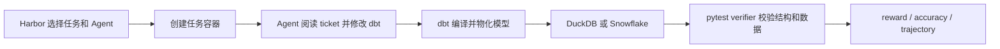

# data-eng-bench、dbt-doris Demo 与 Doris 后端可行性调研

> 调研日期：2026-08-12
>
> data-eng-bench 基线：`master@53353547b9869d35d61b40fd6ee9397a7ac8ca80`
>
> 结论口径：仓库明示事实、静态扫描结果、本地 Codex 会话记录和本文推断分别标注，避免把研发状态写成已发布能力。

## 1. 执行摘要

结论可以压缩成五点：

1. [Snowflake-Labs/data-eng-bench](https://github.com/Snowflake-Labs/data-eng-bench/tree/53353547b9869d35d61b40fd6ee9397a7ac8ca80)
   是一个评测 **Coding Agent 能否正确完成 dbt 数据工程任务** 的 benchmark。
   它不是 DuckDB、Snowflake 或 Doris 的查询性能 benchmark，也不是 dbt adapter
   的官方一致性测试套件。
2. dbt 是被 Agent 修改和执行的工程层；DuckDB 是默认、无需账号、可在容器内密闭
   复现的执行后端；Snowflake 是同一批任务的云后端，用来暴露 SQL 方言、Warehouse、
   Role 和平台惯用法等特定差异。
3. Doris 可以成为第三个执行后端，但正确表述应是 **Doris backend compatibility /
   agent portability evaluation**。不能只替换连接串，也不能据此宣称 Doris 比
   DuckDB 或 Snowflake 更快。
4. dbt-doris 缺少真正可执行、可重复、可进入 CI 的示例项目。应该先补一个独立的
   五分钟 Demo，再移植 `data-eng-bench` 的单个简单任务；不建议直接从 103 个任务
   全量移植开始。
5. 当前 dbt-doris 的“已完善能力”分为上游已合入、本地已提交但未上游、工作区未提交
   三层。Demo 和对外文档必须固定 adapter commit、dbt Core 与 Doris 版本，不能把
   三层能力合并宣传。

建议决策如下：

| 事项 | 建议 | 原因 |
| --- | --- | --- |
| 新增独立 dbt-doris 五分钟 Demo | **立即做** | 价值高、范围小，可补齐用户从安装到看到结果的断点 |
| 将一个 data-eng-bench 任务跑在 Doris | **立即做兼容性试点** | 用真实任务验证端到端能力 |
| 扩展到 5 类代表任务 | **单任务通过后做** | 可形成 SQL、类型、Package、Incremental、Snapshot 兼容矩阵 |
| 直接移植全部 103 个任务 | **条件式推进** | 当前有版本、双工程、数据装载、隔离、方言和 verifier 六类系统性成本 |
| 直接把 Doris 结果提交现有官方榜单 | **暂不做** | 榜单无 backend 维度且 task digest 会变化 |
| 用本仓库比较 Doris 与 DuckDB 查询性能 | **不做** | harness 的测量对象和变量控制都不支持数据库性能结论 |

## 2. 范围、方法与证据等级

本文回答六个问题：

- 本地 Codex 关于 dbt、dbt-doris 的会话形成了什么能力主线？
- `data-eng-bench` 是做什么的，dbt 和 DuckDB 分别扮演什么角色？
- dbt-doris 当前究竟具备哪些已发布、已提交和实验能力？
- 缺少的 dbt-doris Demo 应该长什么样？
- DuckDB 版本的任务能否在 Doris 上运行，改造量和研究价值是什么？
- Snowflake、dbt Labs、DuckDB、Doris 和 Harbor 是否发布了相关资料？

本文采用四类证据：

- **仓库明示**：README、代码、配置、提交、CITATION、NOTICE 和官方文档直接陈述的事实。
- **静态扫描**：在固定 commit 上用文件枚举和文本搜索得到的数字；这些不是项目官方指标。
- **本地会话记录**：只读取顶层 Codex 会话，排除子 Agent 和审批转录；会话中的测试结果视为历史研发证据，不等于本次重新执行。
- **本文推断**：基于上述证据给出的架构、实验设计和路线建议，均明确使用“建议”“预计”或“不能直接”等表述。

GitHub 星标、Issue、网页内容和默认分支都会变化，因此本调研将 `data-eng-bench` 固定在提交
[`53353547`](https://github.com/Snowflake-Labs/data-eng-bench/tree/53353547b9869d35d61b40fd6ee9397a7ac8ca80)。

## 3. 本地 Codex 会话回顾：从能力盘点到发布质量

### 3.1 会话主线

本地会话不是一次性开发，而是逐步收敛成四条主线：

| 时间 | 主题 | 形成的结论或产物 |
| --- | --- | --- |
| 2026-07-24 | 能力盘点 | 建立能力清单，识别测试、物化和发布缺口 |
| 2026-07-27 | v1/v2、Aggregate Key、异步 MV | 分开设计 Doris 物理模型、dbt 语义和 MV 生命周期 |
| 2026-07-27 至 07-30 | Incremental | 补齐四类策略和 `on_schema_change` |
| 2026-08-03 至 08-07 | MV、Snapshot、测试 | 补能力并区分代码存在与生态可交付 |
| 2026-08-11 至 08-12 | 打包、PyPI、标准测试 | 关注构件、发布口径、contract 和复现性 |

代表性顶层会话包括 `019f9222...`（首次能力盘点）、`019fa28c...`（Aggregate Key）、
`019fa28d...`（基础能力）、`019fdb80...`（MV）、`019fdb8b...`（本地会话与 adopter
实现对照）以及 `019ff4d0...`（dbt Unit Testing）。

### 3.2 最新测试会话反映的演进

最新 Unit Testing 会话先记录了一个真实 Doris 环境下的中间状态：官方测试组中 3 组通过，
2 组分别暴露 PostgreSQL `TIMESTAMPTZ` fixture 的方言问题，以及有限长度 `VARCHAR`
被测试输入截断的 adapter 缺陷。随后会话记录显示：改为 Doris 原生 fixture、修复行内
`VARCHAR(n)` 处理、纳入官方测试后，专项测试达到 6/6，Functional Test 从 168 增至
173 并达到 173/173。

这个演进很有价值，因为它证明标准 contract 能发现自编测试遗漏的问题；但它仍有两个限制：

- 本文没有重新运行该测试矩阵，这些数字是会话中的历史结果；
- 对应的若干测试和 CI 文件当前仍在未提交工作区，不能称为上游或 PyPI 发布版保证。

### 3.3 从会话得到的产品判断

会话最终指向的不是“再加几个宏”，而是一个完整交付链：

```text
Adapter 语义
  -> 标准 Contract / Functional Test
  -> Doris 真实集群验证
  -> 可安装构件与版本矩阵
  -> 可运行 Demo
  -> 真实项目兼容性评测
```

`data-eng-bench` 正好可用于最后一层，但它不能替代前面的 adapter 标准测试和最小 Demo。

## 4. data-eng-bench 到底是什么

### 4.1 定位

仓库 [README](https://github.com/Snowflake-Labs/data-eng-bench/blob/53353547b9869d35d61b40fd6ee9397a7ac8ca80/README.md)
将它定义为大型、现实零售数仓上的 dbt 数据工程 Coding Agent 评测。每个任务给 Agent
一个 ticket 风格的需求和容器化 dbt 项目；Agent 修改或创建模型并运行 dbt，随后由运行时
隔离的 pytest verifier 检查物化结果。公开仓库允许维护者审阅 verifier 和 solution；
正式实验应把“不让 Agent 访问 verifier、solution 或网络上的参考解法”作为完整性约束。

执行链可以概括为：



因此它测量的是如下复合能力：

- Agent 能否理解数据工程 ticket；
- 能否在大型 dbt 项目中找到正确的模型、source、ref 和宏；
- 能否写出目标后端可执行且业务语义正确的 SQL；
- 能否正确配置 materialization、test、snapshot 或 incremental；
- 能否通过结构、行级结果、公式和幂等性验证。

### 4.2 任务规模与类别

README 明示共有 103 个任务：

| 类别 | 数量 | 典型工作 |
| --- | ---: | --- |
| Analytics | 65 | 留存、RFM、CLTV、欺诈、归因、商品关联、ROI 等分析 Mart |
| Development / bug fixes | 16 | 修复 SQL、NULL、除零、逻辑或不完整模型 |
| Dimensional modeling / snapshots | 9 | 事实表、维表和 SCD 历史 |
| Data engineering | 13 | Incremental、多数据库和工程型转换 |

难度分布为 3 easy、47 medium、45 hard、8 very hard。上述分类是 README 的汇总口径；
各 `task.toml` 的原始 category vocabulary 更细，不应混为同一个统计口径。

[`dataset.toml`](https://github.com/Snowflake-Labs/data-eng-bench/blob/53353547b9869d35d61b40fd6ee9397a7ac8ca80/dataset.toml)
用 SHA-256 固定每个任务。每个任务都包含 instruction、solution、Docker 环境和 pytest
verifier；一个最小实例可见
[`dbt-fix-division-by-zero`](https://github.com/Snowflake-Labs/data-eng-bench/tree/53353547b9869d35d61b40fd6ee9397a7ac8ca80/tasks/dbt-fix-division-by-zero)。

### 4.3 dbt、DuckDB 和 Snowflake 的角色

| 组件 | 角色 | 不应被误解为 |
| --- | --- | --- |
| dbt | Agent 的工作对象、依赖图、SQL/Jinja 编译和物化执行层 | 只是在任务里偶然出现的工具 |
| DuckDB | 默认、零账号、数据库文件随镜像分发的 hermetic 后端 | 被测数据库性能的基准冠军 |
| Snowflake | 同 103 题的云后端，额外引入方言、Role、Warehouse 和平台惯用法 | 只用于装载 DuckDB 文件 |
| Harbor | 任务打包、容器、Agent 执行、重复试验和结果发布框架 | dbt adapter 测试框架 |

仓库明确说同时运行 DuckDB 与 Snowflake，可以帮助定位“通用建模错误”和“Snowflake
特定错误”。这是一种后端可移植性对照，不是标准数据库性能实验。

### 4.4 工程和数据规模

基础镜像固定了 `dbt-duckdb==1.10.0`、`dbt-snowflake==1.10.3`、
`dbt-core>=1.8,<1.11`、`duckdb==1.2.2`，见
[`base-image/Dockerfile`](https://github.com/Snowflake-Labs/data-eng-bench/blob/53353547b9869d35d61b40fd6ee9397a7ac8ca80/base-image/Dockerfile)。
两套项目均固定 `dbt_utils==1.3.3`。

在固定 commit 上的静态扫描结果为：

- DuckDB `models/` 下有 2,356 个 SQL 和 31 个 YAML，共 2,387 个文件；
- Snowflake `models/` 下有 2,355 个 SQL 和 31 个 YAML，共 2,386 个文件；
- DuckDB 工程中至少 185 个文件直接出现 `dbt_utils.` 调用；
- 两套项目相同相对路径的文件中，只有 238 个字节完全一致，2,183 个不同。

最后一项说明现状不是“一套跨库 SQL 加两个 profile”，而是已经形成实质性的后端双副本。
新增 Doris 若继续复制第三套工程，长期维护成本会显著增加。

合成零售数据库 `retail.duckdb` 由 Git LFS 管理，精确对象大小为 488,910,848 字节；
数据域覆盖订单、客户、商品、库存、SAP、SFDC、GA、POS、WMS、支付、财务和 HR 等。
[`NOTICE`](https://github.com/Snowflake-Labs/data-eng-bench/blob/53353547b9869d35d61b40fd6ee9397a7ac8ca80/NOTICE)
说明任务、模型和 retail 数据为 Snowflake 原创的合成内容，不含真实客户数据或第三方专有数据。

基础镜像构建时会先修正一处源数据问题，再执行 `dbt deps` 和完整 `dbt run`，预物化公共
staging/intermediate 层。Snowflake 版本使用
[`migrate_duckdb.py`](https://github.com/Snowflake-Labs/data-eng-bench/blob/53353547b9869d35d61b40fd6ee9397a7ac8ca80/base-image/migrate_duckdb.py)
枚举 DuckDB schema/table、映射类型并上传；每个 trial 再创建独立数据库 clone。

### 4.5 Verifier 与排行榜实际测什么

固定 commit 的静态扫描显示：

- 103/103 个 verifier 都直接连接并分支处理 DuckDB 与 Snowflake；
- 86/103 查询 `information_schema`；
- 10 个使用 DuckDB `pragma_table_info`；
- 按读取模型源码等模式扫描，约 17 个还会静态检查模型 SQL；
- 上游 [PR #2](https://github.com/Snowflake-Labs/data-eng-bench/pull/2) 描述 verifier
  中存在 436 个 `DB_TYPE` 分支。

PR #2 还删除了 97/103 个任务中“同时兼容 DuckDB 与 Snowflake”的提示，因为一次 trial
实际上只为当前 `DB_TYPE` 评分。PR 作者同时提示，Prompt 变化会让新旧成绩不再严格可比。
这说明后端是 benchmark variant 的组成部分，而不是 Agent 在一次任务中必须顺手兼容的额外目标；
Doris 也应该作为显式、版本化的第三 variant 引入。

任务解法和相关文件的辅助静态扫描还发现：56 题使用 `target.type` Jinja 分支，78 题涉及
日期时间方言，32 题涉及 percentile/median，10 题使用 `adapter.get_relation`，另有少量
ARRAY/JSON/VARIANT、`QUALIFY`、Incremental 和 Snapshot 任务。这些数字不是官方兼容性
声明，但足以说明新增后端不是更改一个 profile。

排行榜主指标是成功 trial 占全部 trial 的比例，同时展示标准误、pass@2、pass@3、Token、
成本和平均时长等信息，见
[`leaderboard.yaml`](https://github.com/Snowflake-Labs/data-eng-bench/blob/53353547b9869d35d61b40fd6ee9397a7ac8ca80/leaderboard/leaderboard.yaml)。
这些是 Agent 完成任务的指标，不能直接解释为数据库吞吐、延迟或性价比。

README 还特别标注 `dbt-fix-timezone-sales` 的 DuckDB verifier 可能受顺序影响，其单项结果
只能作为参考。这也是解读通过率时需要保留任务级已知限制的例子。

## 5. 他们发布了哪些相关资料

### 5.1 data-eng-bench 自身的一手资料

截至调研日，能够确认的一手资料主要是：

- [README](https://github.com/Snowflake-Labs/data-eng-bench/blob/53353547b9869d35d61b40fd6ee9397a7ac8ca80/README.md)：定位、运行方法、后端差异和完整任务概览；
- [Harbor 数据集页面](https://hub.harborframework.com/datasets/snowflake-labs/data-eng-bench/latest)：公开数据集版本；
- [PUBLISHING.md](https://github.com/Snowflake-Labs/data-eng-bench/blob/53353547b9869d35d61b40fd6ee9397a7ac8ca80/PUBLISHING.md)：维护者发布手册；
- [Leaderboard 提交说明](https://github.com/Snowflake-Labs/data-eng-bench/blob/53353547b9869d35d61b40fd6ee9397a7ac8ca80/leaderboard/SUBMIT.md)：
  canonical digest、至少三次 trial 和轨迹审查要求；
- [CITATION.cff](https://github.com/Snowflake-Labs/data-eng-bench/blob/53353547b9869d35d61b40fd6ee9397a7ac8ca80/CITATION.cff)：
  版本 1.0.0，发布日期 2026-07-29；
- [NOTICE](https://github.com/Snowflake-Labs/data-eng-bench/blob/53353547b9869d35d61b40fd6ee9397a7ac8ca80/NOTICE)：数据和代码来源说明；
- [Harbor Dataset 发布文档](https://www.harborframework.com/docs/datasets/publishing)：版本化任务包和发布机制。

仓库因 dbt 商标在 2026-08-03 从 `dbt-bench` 改名为 `data-eng-bench`，见
[`8c103bf`](https://github.com/Snowflake-Labs/data-eng-bench/commit/8c103bf5f3e2d635f0f88811b9ec3910d0c3e164)。

截至 2026-08-12，仓库还没有 GitHub tag 或 GitHub Release，Harbor 已有 `v1.0/latest`；
公开榜单机制已建立，但本次检索没有看到可确认的公开成绩行。项目刚于 2026-07-29 公开，
不能用短期提交量或榜单空白判断项目停滞。

在本次对 Snowflake 官方站点、GitHub 和通用搜索的检索范围内，**未发现专门介绍
`data-eng-bench` 的 Snowflake 官方博客、论文或产品文档**。这表示“截至日期和检索范围内
未发现”，不表示它未来不会发布，也不表示内部没有材料。

### 5.2 Snowflake 的内部 dbt-bench：相关线索，不是已证实血缘

Snowflake 在公开仓库出现之前发布过一篇
[CoCoEvolve 工程文章](https://www.snowflake.com/en/blog/engineering/optimize-snowflake-ai-systems-cocoevolve/)，
其中明确提到一个内部 `dbt-bench`：它评估系统能否端到端创建和维护 dbt project，包括
models、tests、refs 和 lineage；文中实验规模为 82 题。

内部项目与公开仓库曾用相同名称，所属公司、问题领域和发布时间也高度相关，因此“内部前身或
同源任务池”是合理假设。不过公开 `data-eng-bench` 有 103 题，本次没有找到 Snowflake 的
一手资料确认两者任务血缘、重合比例或开源过程。本文不把内部 82 题的成绩当成公开 103 题的
结果，只将该文章视为 Snowflake 建设这类 benchmark 的背景材料。

Snowflake 另有一篇
[使用 Cortex Code 构建 dbt 项目的文章](https://www.snowflake.com/en/blog/building-and-deploying-dbt-projects-on-snowflake-with-cortex-code/)，
展示 Agent 扫描表、生成 model/test、执行 `dbt build` 并验证结果。这解释了其产品侧为什么
需要 Agent + dbt 的端到端评测，但同样不是公开 data-eng-bench 的方法说明。

### 5.3 不要与 dbt Labs 的 ADE-bench 混淆

[dbt-labs/ade-bench](https://github.com/dbt-labs/ade-bench) 是同一问题域的另一个项目。
[dbt Labs 的介绍文章](https://www.getdbt.com/blog/ade-bench-dbt-data-benchmarking)将其描述为
真实 dbt 项目、数据库、任务和 Docker sandbox 组成的 Agent 数据工作评测，也支持 DuckDB
和 Snowflake。

| 维度 | data-eng-bench | ADE-bench |
| --- | --- | --- |
| 维护方 | Snowflake-Labs | dbt Labs |
| 主要形态 | Harbor 上的固定 103 题数据集、验证器和榜单 | 可承载多个项目/任务/数据库的评测框架和 `ade` CLI |
| 当前数据组织 | 一个大型合成 retail warehouse | 多个共享 dbt project、database 和 task variant |
| 主要验证 | pytest 定制验证 | dbt tests、solution seed 和手工测试 |
| 已知后端 | DuckDB、Snowflake | DuckDB、Snowflake |

没有发现一手资料证明 `data-eng-bench` 是 ADE-bench 的 fork、迁移或改名版本；
`data-eng-bench` 的 NOTICE 只说明其排行榜工具来自 Harbor Terminal-Bench 2.1。应将两者称为
“同类独立项目”，不能把 ADE-bench 的测试成绩或宣传结论当成 data-eng-bench 的结果。

Snowflake 已发布多篇使用 ADE-bench 的文章，例如
[Cortex Code CLI 扩展文章](https://www.snowflake.com/en/blog/cortex-code-cli-expands-support/)和
[CoCo 文章](https://www.snowflake.com/en/blog/snowflake-coco-ai-coding-agent-modern-data-stack/)，
但文中明确指向 ADE-bench。它们能证明 Snowflake 重视 Agent 数据工程评测，不能证明
`data-eng-bench` 已获得相同测试结果。

### 5.4 dbt、DuckDB 与 Doris 的相关官方资料

[dbt Adapter 创建指南](https://docs.getdbt.com/guides/adapter-creation)要求 adapter 处理连接、
Relation、Schema、Column、宏和 Materialization，以及 `MERGE`、`IF EXISTS`、Grant 等后端
SQL 差异。它进一步证明“增加 Doris 后端”不是只增加一个连接 profile；不过
`data-eng-bench` 仍不能替代 `dbt-tests-adapter` 等 adapter contract 测试。

[DuckDB 的 dbt 本地转换文章](https://duckdb.org/2025/04/04/dbt-duckdb)展示了为什么 DuckDB
适合作为低运维、全本地 dbt 执行环境；[DuckDB 官方首页](https://duckdb.org/)也强调其进程内、
零外部依赖和单文件可移植特点。这与仓库把 DuckDB 设为 hermetic 默认后端的选择一致。

Apache Doris 已有：

- [dbt-doris 官方文档](https://doris.apache.org/docs/4.x/connection-integration/data-integration/dbt-doris-adapter/)；
- [PyPI 的 dbt-doris 发布页](https://pypi.org/project/dbt-doris/)；
- [Doris Docker Quick Start](https://doris.apache.org/docs/dev/getting-started/quick-start/)；
- [Stream Load](https://doris.apache.org/docs/4.x/key-features/stream-load/)：
  通过 HTTP 导入 CSV、JSON、Parquet 和 ORC，并提供 label 去重与批次原子提交。

[dbt 官方 Doris 平台页面](https://docs.getdbt.com/docs/local/connect-data-platform/doris-setup)
仍把维护入口指向 SelectDB 仓库，而当前 Apache 主线源码位于 `apache/doris`。这不代表旧入口
一定失效，也不等于 dbt Core adapter 不受支持，但说明维护归属、源码入口和版本矩阵存在文档
漂移风险；发布 Demo 时应统一 Apache Doris 文档、PyPI metadata 和 dbt 平台页的链接与口径。

现有 Doris adapter 文档能够完成安装、profile 和基础 materialization 入门，但还不是一个
带输入数据、完整项目、确定结果和 CI 的可执行 Demo；部分线上文档对 Incremental 的描述也
落后于本地研发分支。

## 6. dbt-doris 当前能力：必须分三层表述

### 6.1 上游/PyPI 基线

PyPI 已发布 `dbt-doris 1.0.0`；Apache Doris 上游提交
[`53795dbc`](https://github.com/apache/doris/commit/53795dbcf1bea68300488a2734aadc4b1d09b115)
在 2026-03-27 将 adapter 源码升级到 v1.0.0。上游当前基线的 `setup.py` 要求
`dbt-core>=1.10.4`、Python `>=3.9`。

这一层可用于 Demo 的保守能力包括：

- MySQL 协议连接与 profile；
- dbt database/schema 到 Doris database 的一级命名空间映射；
- Seed、View、Table、基础 Test 和 Docs；
- Doris Table 的 key、partition、distribution、bucket 和 properties 配置。

`database` 与 `schema` 在 dbt-doris 中不能被当成两个独立命名层。profile 中通常省略
`database`，或确保它和 `schema` 一致；跨逻辑 schema 的项目必须专门验证关系渲染和权限。

### 6.2 本地已提交、尚未进入 origin/master

当前研发分支包含但上游 `origin/master` 不包含：

- `634f5e6d7b1d...`：补齐 `append`、`merge`、`delete+insert`、原生
  `insert_overwrite`，并覆盖 `on_schema_change`；
- `fb442f0c151...`：构造完整 Snapshot 历史后原子替换，并处理失败恢复。

当前分支还把依赖目标推进到 dbt Core `~=1.12.0`、Python `>=3.10`。这与
`data-eng-bench` 的 `dbt-core<1.11` 存在直接版本冲突；基础试点应使用发布版兼容栈，
增强能力试点则应使用独立 Doris 镜像，不能静默升级原有 DuckDB/Snowflake 基镜像。

### 6.3 当前未提交工作区

审计时工作区另有 18 个 tracked 修改（其中 17 个位于 `extension/dbt-doris`，另一个为 CI）
和 17 个 `extension/dbt-doris` untracked 条目，涉及：

- 异步物化视图 materialization；
- Partition、Relation 和 Metadata 增强；
- Contract、Freshness、Hooks、MV、Partition 和 Unit Testing；
- Adapter API、连接、宏、打包等单元测试；
- CI、用户指南、状态报告和 MV 指南。

这些工作可以作为后续路线输入，但不能写成“Apache Doris 上游已经支持”或“PyPI 1.0.0
已经支持”。未提交文档之间还存在 `microbatch`、`delete+insert`、`grants` 和 MV 刷新语义
的冲突，发布前应先让代码、测试和文档使用同一事实源。

### 6.4 Demo 缺口是真实的

`extension/dbt-doris` 当前没有 `examples/`、`demo/` 或独立 sample project。README 只有安装、
profile 和少量能力入口，尚缺：

- 可重复输入数据；
- 完整 `dbt_project.yml`；
- `source/seed -> staging view -> mart table -> test` 链；
- Doris key、distribution、bucket 和单副本配置；
- 确定的预期输出；
- 第二次运行和幂等性说明；
- 自动 smoke 或 CI；
- 已验证的 `dbt_utils` 示例。

这正是用户从“安装 adapter”到“相信它能完成一个项目”之间的断层。

## 7. 建议的 dbt-doris Demo

### 7.1 第一层：五分钟、稳定能力 Demo

建议新增 `extension/dbt-doris/examples/retail_quickstart/`，使用自有的小型合成数据，避免让
入门 Demo 依赖 489 MB LFS 文件或 Snowflake 仓库的完整任务数据。

```text
retail_quickstart/
├── README.md
├── dbt_project.yml
├── profiles.yml.example
├── seeds/
│   └── raw_orders.csv
├── models/
│   ├── staging/
│   │   └── stg_orders.sql
│   ├── marts/
│   │   └── fct_daily_sales.sql
│   └── schema.yml
├── tests/
│   └── assert_total_amount_nonnegative.sql
└── expected/
    └── fct_daily_sales.csv
```

最小故事线为：

```text
raw_orders Seed
  -> stg_orders View
  -> fct_daily_sales Duplicate Key Table
  -> generic test + singular test + docs artifact
```

验收命令应只有：

```bash
dbt debug
dbt seed
dbt build
dbt docs generate
dbt build
```

最后一次重复 `dbt build` 用来证明基本幂等性。Demo 还应满足：

- profile 只引用环境变量，不保存密码；
- 单 BE 环境显式设置 `replication_num=1`、`distributed_by` 和 `buckets=1`；
- README 固定 dbt-doris、dbt Core 和 Doris 版本；
- 给出行级预期结果和失败排查入口；
- 第一版不依赖第三方 dbt Package，只使用上游/PyPI 已稳定能力；
- 在干净虚拟环境中安装 Wheel/Sdist 后执行 smoke。

### 7.2 第二层：能力展示 Demo

当对应提交进入目标发布版后，再增加 Incremental、Snapshot 和异步 MV 场景：

- 首次构建、新增行、更新行、重复批次和 Schema Change；
- Snapshot 的新增、修改、删除、失败重跑和历史校验；
- Contract、Freshness、Hooks 和 Persist Docs；
- 对 `dbt_utils` 按宏公布验证矩阵，而不是笼统声称 Package 兼容；
- 每个高级能力都在 CI 的真实 Doris 集群中运行。

“五分钟 Demo”和“能力展示 Demo”应分开。前者追求稳定、短、可复制；后者追求覆盖，允许按
版本加 Feature Gate。

## 8. DuckDB 任务能否改用 Doris

### 8.1 可以，但应增加第三后端而不是替换 DuckDB

Doris 版本最有价值的研究问题是：

1. 固定 Agent、模型和任务后，SQL/dbt 工程在 Doris 上能否得到同一业务结果？
2. 失败来自 Agent、SQL 方言、dbt-doris adapter，还是 benchmark harness？
3. 哪些 Doris 物理表语义需要 Agent 显式配置，哪些应由 adapter 提供合理默认？
4. dbt-doris 的标准测试通过后，放入一个大型真实 dbt DAG 是否仍有系统性缺口？

DuckDB 仍应保留为低成本、密闭、快速定位通用建模错误的控制组。Doris 是分布式服务，会增加
启动、网络、并发、资源和清理变量；删除 DuckDB 反而会失去很有价值的故障定位基线。

### 8.2 不是替换连接串：八个改造面

| 改造面 | 当前假设 | Doris 所需工作 |
| --- | --- | --- |
| 版本 | Core <1.11，两种 adapter 1.10 | 选择 1.10 试点或 1.12 独立镜像 |
| dbt 工程 | DuckDB/Snowflake 双副本 | 新增 Doris variant，并抽离共同 SQL/宏 |
| Profile | 文件路径或 Snowflake 账号 | Doris 连接、命名空间和线程数 |
| 数据装载 | 镜像内 DuckDB 文件或 Snowflake 迁移器 | 导出、建 DDL、Stream Load、校验 |
| 隔离 | 容器写层或 Snowflake zero-copy clone | trial 数据库/用户或只读 raw + 独立输出 |
| SQL/materialization | 两套后端方言 | 函数、类型、物化和 Doris 表模型 |
| Verifier | 两种 connector/metadata | backend fixture、Doris 查询和类型归一化 |
| 发布/榜单 | 固定 task digest，无 backend | 新 revision、backend 字段或独立榜单 |

### 8.3 数据迁移建议

推荐先迁移任务依赖闭包，而不是第一天就搬完整 489 MB 和 2,356 个 SQL 模型：

1. 从 DuckDB 枚举目标任务依赖的 source/table；
2. 导出为 Parquet 或 CSV；
3. 显式映射 Boolean、Decimal、Date、Timestamp、字符串和复杂类型；
4. 按 Doris 表模型生成 key、distribution、bucket 和 `replication_num`；
5. 使用 Stream Load 导入，label 包含数据版本、表和 attempt；
6. 校验表数、行数、列定义、NULL 数和稳定 checksum；
7. 运行 golden `solution/solve.sh` 与 verifier，只有答案脚本 100% 通过后才运行 Agent。

Doris 的 dbt database/schema 是一级命名空间，而 benchmark 使用多个 schema。试点应比较两种方案：

- **推荐先验证**：每个逻辑 schema 映射为一个 Doris database，并用 trial 前缀隔离；
- **备选**：所有表落入一个 database，表名加 schema 前缀，但会造成更大 SQL 改写并降低任务忠实度。

跨 database `source/ref`、权限和 `generate_schema_name` 必须进入 tracer task 的显式验收项。

### 8.4 Trial 隔离建议

Doris 没有可直接照搬的 Snowflake zero-copy database clone。更可行的初始设计是：

- 一个独立、非生产的 Doris 测试集群；
- raw 数据库默认只读并在 trial 间共享；
- 每个 trial 创建唯一的 staging/intermediate/marts 数据库和受限用户；
- 需要修改 source 的少数任务只复制自己的 source 闭包；
- verifier 使用管理员只读凭据，Agent 只能访问本 trial 范围；
- 健康检查等待 FE/BE 和真实查询成功，结束时按 trial ID 清理。

这样可以减少 489 MB × 并发 trial 的重复装载，但仍需测试 Doris Compaction、Schema Change 和
残留对象是否影响下一次试验。不要连接生产 Doris 集群。

### 8.5 Verifier 应先抽象再扩展

直接在 103 个 verifier 中增加第三组 `if DB_TYPE == 'doris'` 会继续放大 436 个分支。
建议先形成统一接口：

```text
Backend
├── connect()
├── execute(sql)
├── fetch_relation(database, schema, identifier)
├── list_columns(relation)
├── normalize_value(value, logical_type)
└── cleanup(trial_id)
```

归一化至少覆盖：

- 标识符大小写和 quoting；
- `DECIMAL` 精度与 Python 表示；
- `DATE`、`TIMESTAMP` 和时区；
- `NULL` 排序与三值逻辑；
- 浮点 tolerance；
- `information_schema` 字段差异；
- DuckDB `PRAGMA` 对应的 Doris 元数据查询。

业务 oracle 应保持不变；只有后端表示差异可以归一化。若为了让 Doris 通过而改变业务期望，
该任务已经不再与原任务等价。

## 9. 公平性、指标与对外口径

### 9.1 可以回答的问题

只有在同一个三后端 dataset revision 内，保证 task digest、Prompt、Agent、模型、
Token/时间预算、并发和 golden solution 相同，Doris variant 才可以回答：

- 同一 Agent 在不同 dbt 后端上的任务成功率差异；
- dbt SQL 和 Jinja 的跨后端可移植程度；
- dbt-doris 在真实大型项目中暴露的能力缺口；
- Doris 特定表模型、函数和类型对 Agent 的额外要求；
- skills、文档或 native tools 是否能改善 Doris 任务成功率。

由于增加 Doris 必须修改镜像、profile、verifier，部分任务还需要修改 instruction，试点结果
不能直接与官方 v1.0 已有 DuckDB/Snowflake 行做严格 A/B。比较三后端时应在新的统一 revision
中重跑全部对照组；PR #2 已说明 Prompt 变化本身就会破坏新旧成绩的严格可比性。

### 9.2 不能回答的问题

当前 harness 不能严谨回答：

- Doris 与 DuckDB 谁的查询延迟更低；
- 单机 DuckDB 与多节点 Doris 谁的性价比更高；
- Doris 在标准 TPC-H/TPC-DS 意义上的数据库性能；
- 一次 Agent 任务总耗时能否代表数据库执行时间。

Agent 推理、容器启动、dbt parse/compile、网络、Doris Compaction、Snowflake Warehouse 等都混入
总耗时。若要做数据库性能对比，应另建工作负载，固定数据规模、硬件、并发、缓存、SQL、
统计方法和 warm-up，并把 Agent 完全移出测量路径。Apache Doris 已有独立的
[Benchmark 总览](https://doris.apache.org/why-doris/benchmarks/)、
[TPC-DS 指南](https://doris.apache.org/docs/3.x/benchmark/tpcds/)和
[TPC-H 指南](https://doris.apache.org/docs/3.x/benchmark/tpch/)；性能研究应沿这条受控实验线
开展，不与 Agent benchmark 的 accuracy 混为一项指标。

### 9.3 失败必须分层归因

建议 Doris 试点输出以下失败分类，而不是只有 pass/fail：

| 层级 | 示例 |
| --- | --- |
| Agent | 误解 ticket、改错模型、未运行 dbt |
| dbt project | `ref/source`、Package、Jinja 或 materialization 配置错误 |
| SQL dialect | 函数、类型、日期、复杂类型或标识符不兼容 |
| dbt-doris | relation、catalog、incremental、snapshot、contract 等 adapter 缺陷 |
| Doris engine | 执行语义、版本能力或服务故障 |
| Harness | loader、隔离、healthcheck、verifier 或 cleanup 错误 |

只有这样，Doris 成绩才会反过来推动 adapter 和产品改进，而不是成为一个无法解释的百分比。

### 9.4 暂不进入现有官方榜单

现有 leaderboard 要求 canonical dataset 和相同 task digest，但当前行元数据没有清晰的
backend 维度。新增 Doris connector、verifier 和任务工程会改变 digest；若只用环境变量绕过，
又可能把不同后端的结果混入同一排名。

推荐先发布：

> `data-eng-bench Doris backend compatibility pilot`，固定 data-eng-bench commit、
> dbt-doris commit、Doris 版本、数据版本、Agent/模型、任务列表、通过率和失败分类；
> 明确标注“非官方、非数据库性能结果”。

稳定后再与上游讨论以下任一方案：

- dataset metadata 和 leaderboard 增加 backend 字段；
- 为 Doris 发布独立 dataset revision 和 digest；
- 为每个 backend 建独立 sub-leaderboard；
- 将共同 verifier 抽象贡献回上游。

仓库是 Apache-2.0，可以依法复用，但衍生数据集仍应保留 LICENSE/NOTICE 和 Snowflake 原始作品
归属；正式提交前应先通过 Issue 与维护者确认 scope 和榜单语义。

## 10. 推荐落地路线

### P0：统一 dbt-doris 的事实源

- 明确 PyPI/上游、本地已提交、未提交三层能力；
- 解决 `microbatch`、`delete+insert`、`grants` 和 MV 刷新语义的文档冲突；
- 确定 1.10 稳定基线与 1.12 增强基线各自的测试矩阵；
- 用标准 adapter tests、真实 Doris 和干净安装验证目标 commit。

退出条件：给定版本矩阵中的能力、代码、测试和文档一致。

### P1：交付五分钟 dbt-doris Demo

- 完成 Seed -> View -> Table -> Test -> Docs；
- 提供确定预期结果、重复运行和 CI smoke；
- 只使用已发布稳定能力。

退出条件：新用户在干净环境按 README 可独立完成，CI 可重复。

### P2：一个 data-eng-bench tracer task

首选
[`dbt-daily-order-summary`](https://github.com/Snowflake-Labs/data-eng-bench/tree/53353547b9869d35d61b40fd6ee9397a7ac8ca80/tasks/dbt-daily-order-summary)：

- easy，且属于 `fast-30`；
- standalone `/app/dbt_project`，不依赖完整预构建 DAG；
- 单一 `ORDERS.ORDERS` source；
- 覆盖日期转换、过滤、分组、聚合和 Table materialization；
- verifier 有 13 个测试，覆盖 schema、列、数据和幂等性。

退出条件：Doris golden solution 连续通过，重复 trial 不互相污染，再运行至少一个 Agent。

### P3：五类代表任务

建议按能力而不是随机选题：

1. 基础 Table 与聚合：`dbt-daily-order-summary`；
2. 多 source、staging view 与 `ref`：`dbt-customer-geographic`；
3. Package/窗口 tracer：`dbt-consolidate`，覆盖 `dbt_utils`、窗口和 `QUALIFY`；
4. `dbt-incremental-late-arriving-sales`；
5. `dbt-fix-customer-snapshot-and-build-dimension`。

退出条件：形成函数、类型、Package、materialization 和 verifier 兼容矩阵；每个失败都能归类。

### P4：fast-30 与全量决策

完成 backend abstraction 和公共 base project 适配后跑 `fast-30`。只有 golden solution 在全部
已声明支持任务上通过，且装载、隔离与清理稳定，才评估 103 题全量移植。

### P5：选择上游方向

- 若目标是展示一个大型零售项目上的 Doris/dbt/Agent 能力，继续推进 data-eng-bench Doris variant；
- 若目标是让更多 dbt 项目复用 Doris 作为评测后端，可以同时评估给
  [ADE-bench](https://github.com/dbt-labs/ade-bench) 增加 Doris database variant；
- 两条路线都应建立在独立 Demo 和 adapter 标准测试之上。

## 11. 最终建议

这是一个值得做的生态机会，但最佳切入点不是“把 DuckDB 全部替换成 Doris”。

最合理的产品叙事是：

> Apache Doris 先提供一个真正可运行的 dbt-doris Demo，再把 Doris 作为
> data-eng-bench 的第三个后端做兼容性试点，用真实 dbt 任务持续发现 SQL、Package、
> materialization 和 Agent 工具链缺口。

最合理的研究设计是：

> 保留 DuckDB 作为 hermetic 控制组，在同一个三后端 revision 内固定 task digest、Prompt、
> Agent 和预算；先让 golden solution 100% 通过，再测 Agent；按层归因失败，并单独发布
> Doris variant 元数据。

最需要避免的口径是：

> 用一次 Harbor 任务耗时或通过率，宣称 Doris 与 DuckDB 的数据库性能优劣；或把本地提交、
> 未提交测试和工作区文档统一写成 dbt-doris 已发布能力。

按 P0 至 P3 推进后，我们既能补上用户当前最需要的 Demo，也能获得一个比“功能列表”更有说服力
的、可重复的 dbt-doris 真实工程验证入口。
